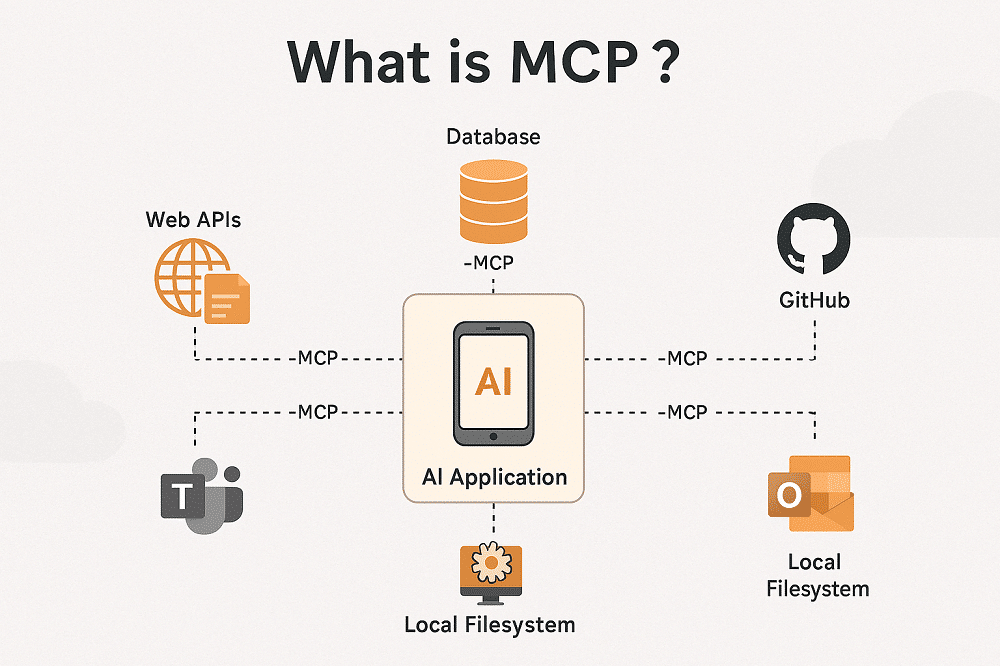
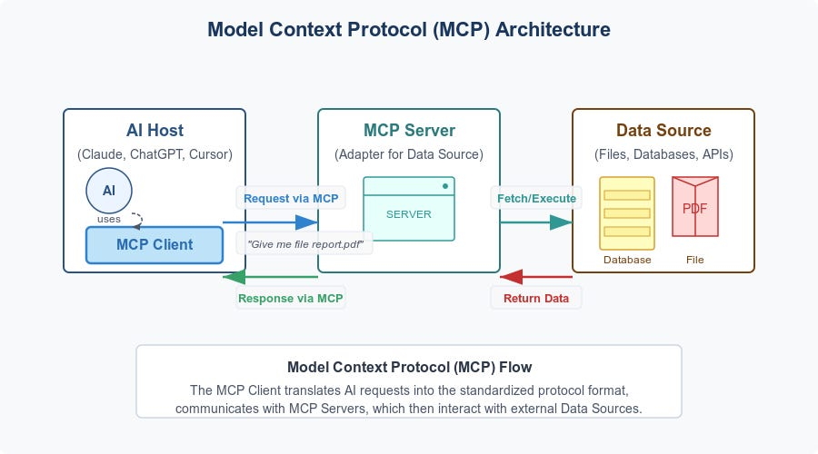
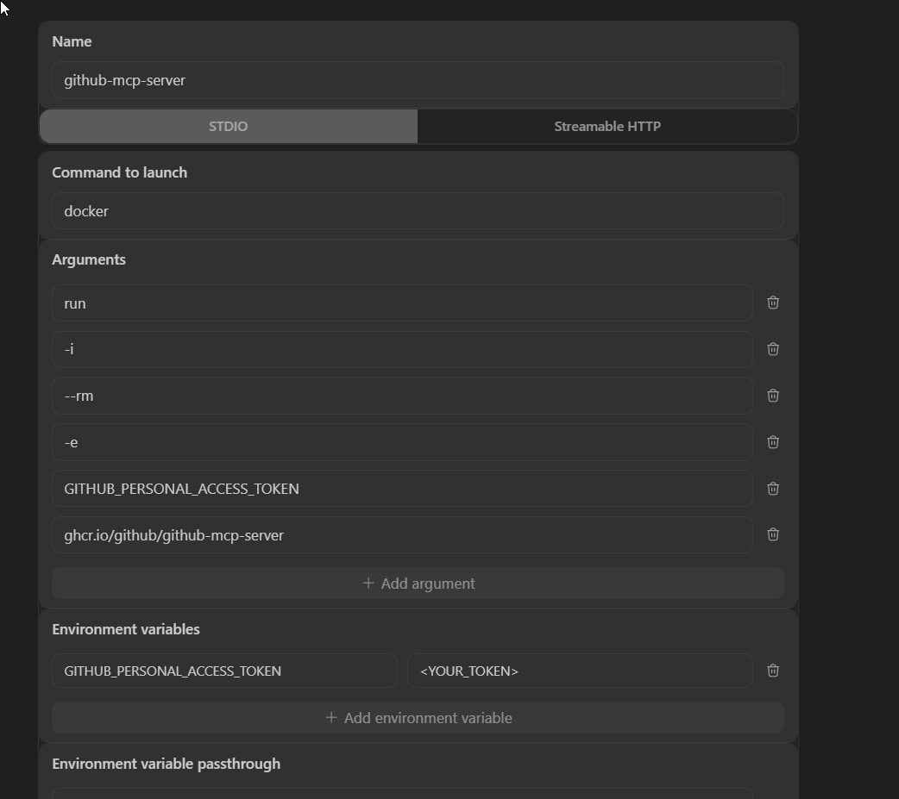
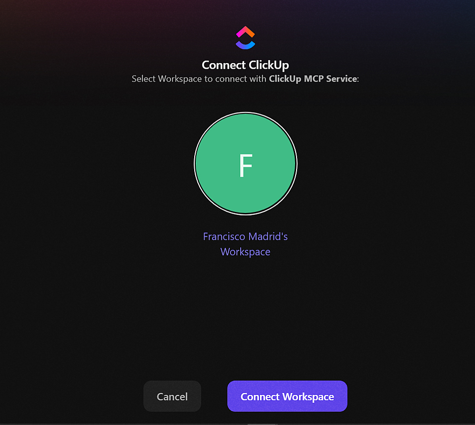

# MCP (Model Context Protocol)

El **Model Context Protocol (MCP)** es el estándar de comunicación que permite a los modelos de IA interactuar con el mundo real. Actúa como un puente entre la lógica del LLM y herramientas externas: bases de datos, APIs, navegadores, servicios de diseño, gestores de proyectos, etc.



> [!NOTE]
> Para ver la configuración MCP específica de cada agente (Gemini CLI, Claude Code, Cursor, etc.), consulta su archivo dedicado en `../tools/`. Esta guía cubre el concepto general, buenas prácticas y las configuraciones de los MCP más utilizados.

---

## Arquitectura y Componentes

### Tools, Resources y Prompts
Un servidor MCP expone tres tipos de recursos al modelo:

| Componente   | Descripción                                                                 |
| :----------- | :-------------------------------------------------------------------------- |
| **Tools**    | Funciones que el modelo puede "llamar" (ej. `get_pull_request`, `list_tasks`) |
| **Resources**| Datos estáticos o dinámicos que el modelo puede leer (ej. logs en tiempo real) |
| **Prompts**  | Instrucciones predefinidas que se pueden invocar como slash commands          |

### Transportes y Protocolos
Define cómo se comunican el cliente (IDE) e el servidor:

| Transporte        | Cuándo usarlo                                                    |
| :---------------- | :--------------------------------------------------------------- |
| `stdio`           | Proceso local. Más simple, sin red. Recomendado para desarrollo. |
| `SSE`             | HTTP con streaming. Para servers remotos o en Docker.            |
| `Streamable HTTP` | Variante moderna de SSE. Preferida en producción.                |



---

## Archivos de Configuración por Agente

### Rutas de Configuración (Windows)
```text
Antigravity   -> C:\Users\<USER>\.gemini\antigravity\mcp_config.json
Gemini CLI    -> C:\Users\<USER>\.gemini\settings.json
Codex CLI     -> C:\Users\<USER>\.codex\config.toml
Cursor        -> <project>\.cursor\mcp.json   |   ~/.cursor/mcp.json (global)
Claude Code   -> <project>\.mcp.json          |   ~/.claude.json (global)
```

> [!TIP]
> Si el OAuth de Antigravity se corrompe en algún MCP, se puede resetear eliminando los archivos de `~/.mcp-auth`.

---

## Buenas Prácticas

### Principio de Menor Privilegio
Desactiva tools innecesarias para ahorrar tokens y mejorar la precisión del modelo.

### Patrones de Exclusión por Agente
Activa únicamente las tools que realmente vas a usar. Revisa la documentación de cada MCP y construye una lista de exclusiones.

#### Ejemplo: Configuración JSON (Exclusiones)
```json
{
  "mcpServers": {
    "mi-servidor": {
      "command": "...",
      "args": ["..."],
      "disabledTools": ["tool_peligrosa", "otra_tool"]
    }
  }
}
```

#### Ejemplo: Configuración Codex CLI (TOML)
```toml
[mcp_servers.mi-servidor]
command = "docker"
args = ["..."]
disabled_tools = ["tool_peligrosa"]
```

### Docker: Persistencia vs Eficiencia
Levantar un servidor con `docker run` en cada IDE consume recursos excesivos. La mejor práctica es usar un contenedor persistente y conectar los IDEs vía `exec -i`.

#### Ejemplo: Configuración Shared Container
```json
{
  "command": "docker",
  "args": ["exec", "-i", "github-mcp", "/server/github-mcp-server", "stdio"]
}
```

> [!WARNING]
> Si usas `docker run` (con `--rm`) en cada IDE, cada ventana levanta su propio contenedor. Siempre que puedas, usa el patrón `exec -i` con un contenedor con nombre compartido.

---

## Colección de MCPs

### MCPs Oficiales
Servidores publicados y mantenidos por los proveedores oficiales.

#### GitHub MCP
Permite operar sobre repositorios, pull requests e issues. Requiere un `GITHUB_PERSONAL_ACCESS_TOKEN`.

**Requisito:** Variable de entorno `GITHUB_PERSONAL_ACCESS_TOKEN` configurada en el sistema.

**Configuración recomendada — contenedor único compartido:**

```shell
# Run once — the container stays alive with --restart unless-stopped
docker run -d -i --name github-mcp --restart unless-stopped \
  -e GITHUB_PERSONAL_ACCESS_TOKEN \
  ghcr.io/github/github-mcp-server:v0.30.3 stdio
```

#### Ejemplo: Configuración GitHub (JSON)
```json
{
  "mcpServers": {
    "github-mcp-server": {
      "command": "docker",
      "args": ["exec", "-i", "github-mcp", "/server/github-mcp-server", "stdio"],
      "disabledTools": ["sub_issue_write", "delete_file"]
    }
  }
}
```

**Configuración para Codex CLI (`config.toml`):**

```toml
[mcp_servers.github-mcp-server]
command = "docker"
args = ["exec", "-i", "github-mcp", "/server/github-mcp-server", "stdio"]
enabled = true

[mcp_servers.github-mcp-server.env]
GITHUB_PERSONAL_ACCESS_TOKEN = "<YOUR_TOKEN>"
```



> [!TIP]
> Si no tienes Docker, usa `docker run -i --rm` en lugar de `exec -i`. Recuerda que eso levanta un contenedor nuevo por cada IDE abierto.

---

#### ClickUp MCP (Oficial)
Servidor oficial para gestionar tareas y documentos. Usa autenticación **OAuth**.

Servidor MCP oficial de ClickUp. La autenticación es por **OAuth** — al configurarlo, el agente abrirá una ventana del navegador para autorizar el acceso.

> [!WARNING]
> Si el agente no responde correctamente después de activar ClickUp MCP, deshabilita la tool `clickup_get_workspace_hierarchy`. Esta tool descarga la jerarquía completa del workspace y puede saturar la ventana de contexto.

**Configuración recomendada:**

#### Ejemplo: Configuración ClickUp (JSON)
```json
{
  "mcpServers": {
    "clickup": {
      "command": "npx",
      "args": ["-y", "mcp-remote", "https://mcp.clickup.com/mcp"],
      "disabledTools": ["clickup_get_workspace_hierarchy"]
    }
  }
}
```

**Autenticación en Gemini CLI:**

```shell
# After adding the config to settings.json, run inside gemini:
/mcp auth clickup
```



**Configuración para Codex CLI (`config.toml`):**

```toml
[mcp_servers.clickup-mcp]
enabled = true
url = "https://mcp.clickup.com/mcp"
```

---

#### Figma MCP (Oficial)
Permite leer estilos, colores y componentes de archivos Figma. Requiere **Dev Mode** y OAuth.

Servidor MCP oficial de Figma. Permite al agente leer estilos, colores, tipografías y componentes de un archivo. La autenticación es por **OAuth**.

> [!WARNING]
> Antigravity solo soporta el MCP oficial de Figma a través del **Dev Mode**, que requiere una cuenta de pago (Pro o superior).

**Instalación en Gemini CLI (via Extension):**

```shell
gemini extensions install https://github.com/figma/figma-gemini-cli-extension
```

```shell
# Authenticate inside gemini:
/mcp auth figma
```

---

### MCPs de Terceros (Community)
Servidores mantenidos por la comunidad que cubren casos no oficiales.

#### Figma Console MCP
Alternativa comunitaria que se comunica con Figma Desktop sin depender de cuenta Pro.

**Repositorio:** [github.com/southleft/figma-console-mcp](https://github.com/southleft/figma-console-mcp)

Alternativa community al MCP oficial de Figma. Se comunica con Figma Desktop a través de un plugin local, sin depender de servidor remoto ni de cuenta Pro.

> [!NOTE]
> Requiere la **aplicación desktop de Figma** instalada y activa. Ejecuta el siguiente comando para obtener la ruta del manifest del plugin: `npx figma-console-mcp@latest --print-path`

**Configuración con Access Token:**

##### Ejemplo: Configuración Figma Console (JSON)
```json
{
  "mcpServers": {
    "figma-console": {
      "command": "npx",
      "args": ["-y", "figma-console-mcp@1.22.1"],
      "env": {
        "FIGMA_ACCESS_TOKEN": "figd_TOKEN",
        "ENABLE_MCP_APPS": "true"
      }
    }
  }
}
```

Para usar la version mas reciente:

`figma-console-mcp@latest`

##### White List

```json
 // gemini-cli
 "includeTools": [
  "figma_add_component_property",
    "figma_add_mode",
    "figma_analyze_component_set",
    "figma_arrange_component_set",
    "figma_audit_component_accessibility",
    "figma_batch_create_variables",
    "figma_batch_update_variables",
    "figma_capture_screenshot",
    "figma_clone_node",
    "figma_create_child",
    "figma_create_variable",
    "figma_create_variable_collection",
    "figma_delete_component_property",
    "figma_delete_node",
    "figma_delete_variable",
    "figma_delete_variable_collection",
    "figma_edit_component_property",
    "figma_execute",
    "figma_generate_component_doc",
    "figma_get_annotation_categories",
    "figma_get_annotations",
    "figma_get_component",
    "figma_get_component_details",
    "figma_get_component_for_development",
    "figma_get_component_for_development_deep",
    "figma_get_component_image",
    "figma_get_design_changes",
    "figma_get_design_system_kit",
    "figma_get_design_system_summary",
    "figma_get_file_data",
    "figma_get_file_for_plugin",
    "figma_get_library_components",
    "figma_get_selection",
    "figma_get_status",
    "figma_get_styles",
    "figma_get_text_styles",
    "figma_get_token_values",
    "figma_get_variables",
    "figma_instantiate_component",
    "figma_lint_design",
    "figma_list_open_files",
    "figma_move_node",
    "figma_navigate",
    "figma_reconnect",
    "figma_reload_plugin",
    "figma_rename_mode",
    "figma_rename_node",
    "figma_rename_variable",
    "figma_resize_node",
    "figma_search_components",
    "figma_set_annotations",
    "figma_set_description",
    "figma_set_fills",
    "figma_set_image_fill",
    "figma_set_instance_properties",
    "figma_set_strokes",
    "figma_set_text",
    "figma_setup_design_tokens",
    "figma_take_screenshot",
    "figma_update_variable"
  ]
```

#####  Black List

Lista de tools que no son para Developers, ni Designers.

```json
  // gemini-cli
  "excludeTools": [
    "figjam_auto_arrange",
    "figjam_create_code_block",
    "figjam_create_connector",
    "figjam_create_section",
    "figjam_create_shape_with_text",
    "figjam_create_stickies",
    "figjam_create_sticky",
    "figjam_create_table",
    "figjam_get_board_contents",
    "figjam_get_connections",
    "figma_add_shape_to_slide",
    "figma_add_text_to_slide",
    "figma_check_design_parity",
    "figma_clear_console",
    "figma_create_slide",
    "figma_delete_comment",
    "figma_delete_slide",
    "figma_duplicate_slide",
    "figma_focus_slide",
    "figma_get_comments",
    "figma_get_console_logs",
    "figma_get_focused_slide",
    "figma_get_slide_content",
    "figma_get_slide_grid",
    "figma_get_slide_transition",
    "figma_list_slides",
    "figma_post_comment",
    "figma_reorder_slides",
    "figma_scan_code_accessibility",
    "figma_set_slide_background",
    "figma_set_slide_transition",
    "figma_set_slides_view_mode",
    "figma_skip_slide",
    "figma_watch_console"
  ]
```

---

#### Trello MCP
Gestión de tableros y tarjetas. Requiere `TRELLO_API_KEY` y `TRELLO_TOKEN`.

**Repositorio:** [npmjs.com/package/mcp-server-trello](https://www.npmjs.com/package/mcp-server-trello)

Permite al agente leer y gestionar tableros, listas y tarjetas de Trello.

**Requisitos:** Variables de entorno `TRELLO_API_KEY` y `TRELLO_TOKEN`.
Generarlas en: [trello.com/power-ups/admin](https://trello.com/power-ups/admin)

**Configuración (variables de entorno del sistema):**

```json
{
  "mcpServers": {
    "trello": {
      "command": "npx",
      "args": ["-y", "mcp-server-trello"]
    }
  }
}
```

**Configuración (variables en el archivo de config):**

```json
{
  "mcpServers": {
    "trello": {
      "command": "npx",
      "args": ["-y", "mcp-server-trello"],
      "env": {
        "TRELLO_API_KEY": "<TRELLO_API_KEY>",
        "TRELLO_TOKEN": "<TRELLO_TOKEN>"
      }
    }
  }
}
```

---

## Recursos Adicionales

### Directorios y Hubs
Recursos para descubrir y configurar nuevos servidores MCP.

| Recurso                                              | Descripción                                                       |
| :--------------------------------------------------- | :---------------------------------------------------------------- |
| [hub.docker.com/u/mcp](https://hub.docker.com/u/mcp) | Imágenes Docker oficiales de los MCPs más populares.             |
| [mcp.so](https://mcp.so)                             | Directorio comunitario de servidores MCP.                        |
| [geminicli.com/extensions](https://geminicli.com/extensions/) | Extensiones y MCPs específicos para Gemini CLI.         |
| [cursor.directory](https://cursor.directory)         | Marketplace de reglas, skills y MCPs para Cursor.                |

*Fuente: [Model Context Protocol — Specification](https://spec.modelcontextprotocol.io/)*
