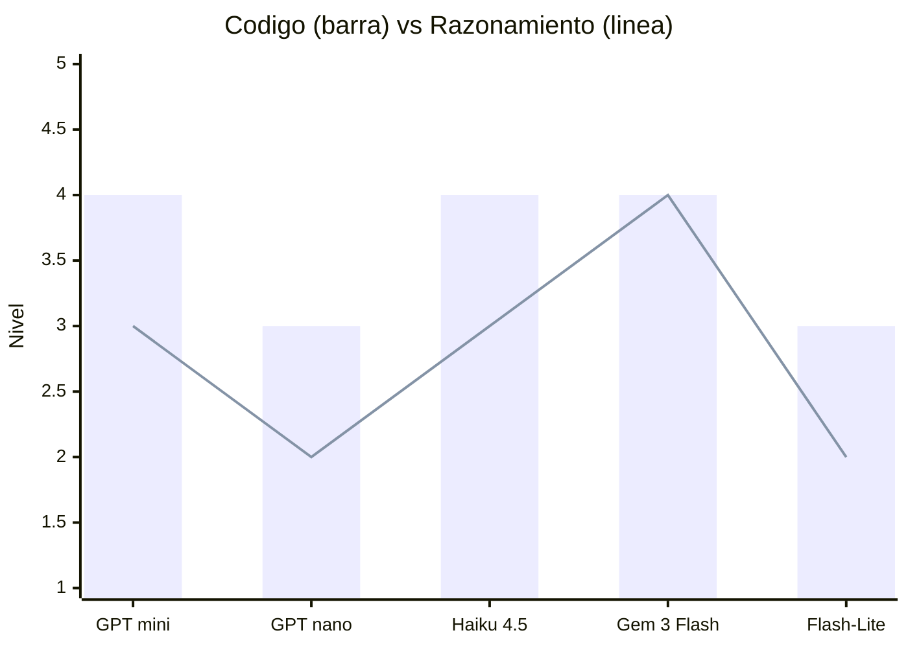
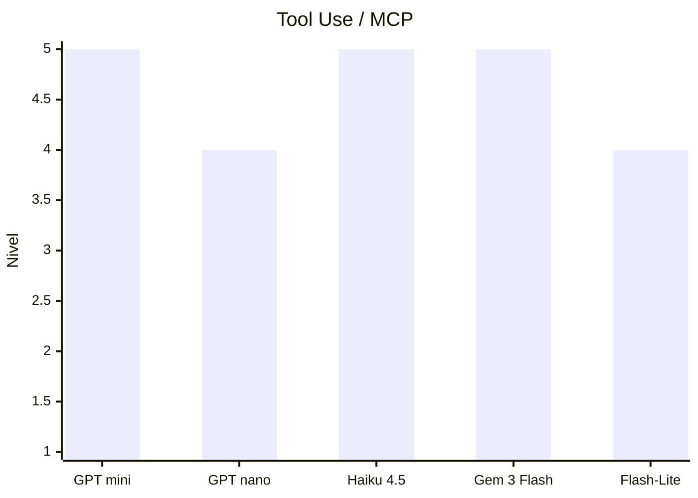
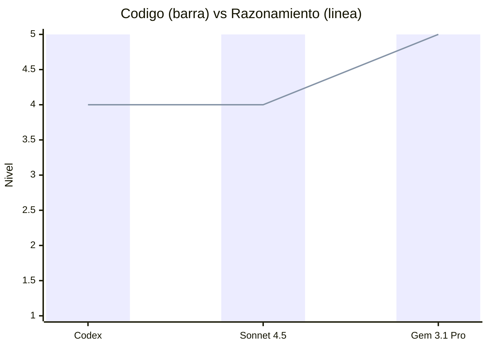
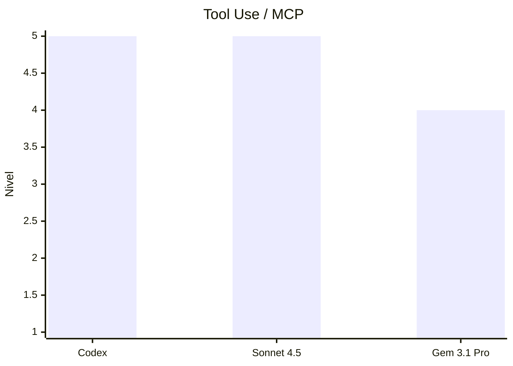
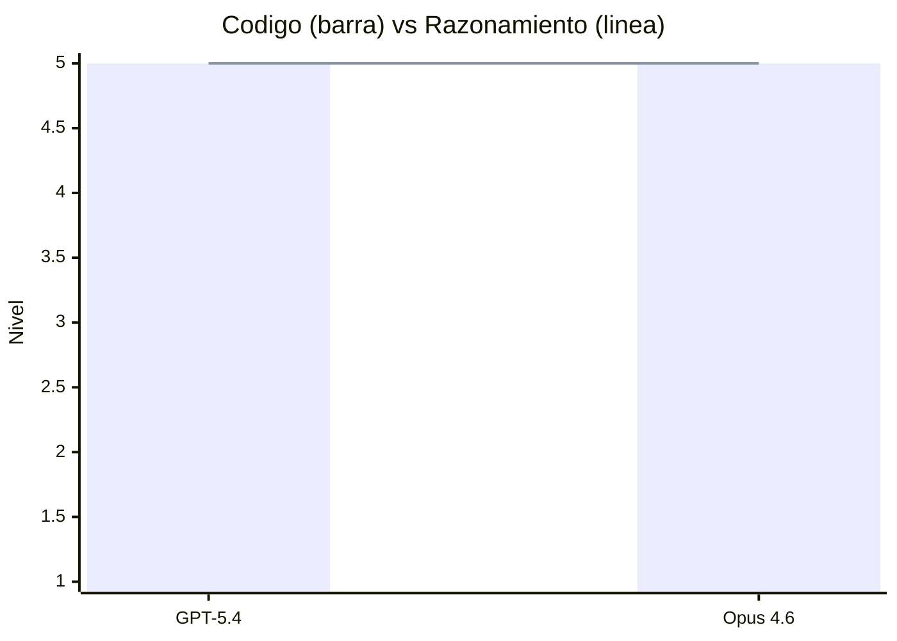
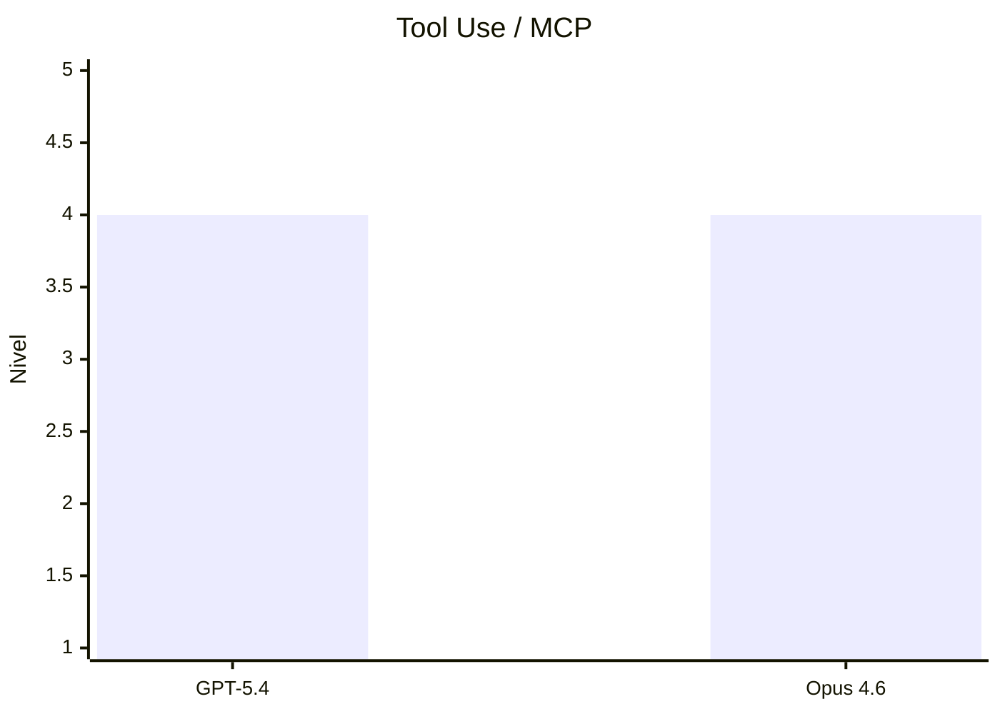
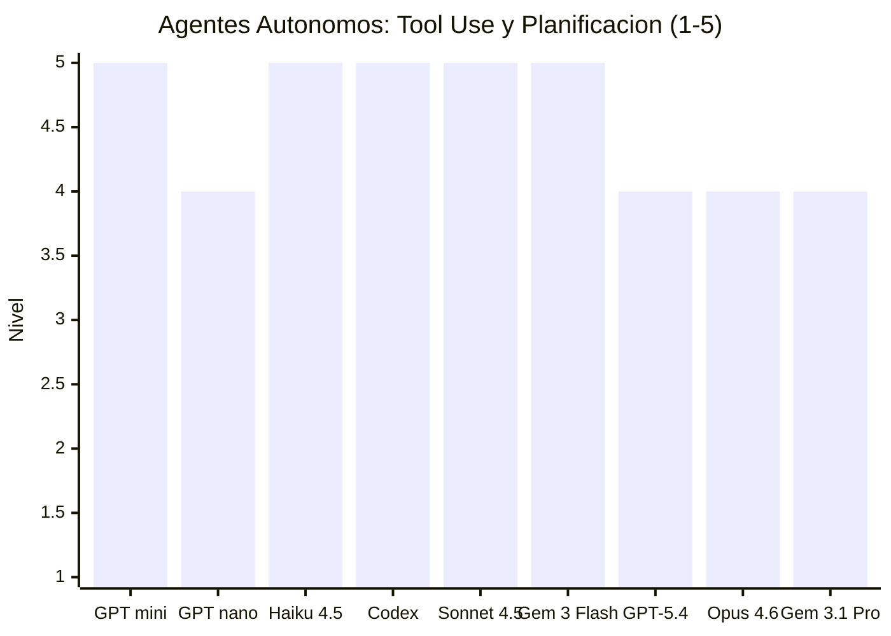
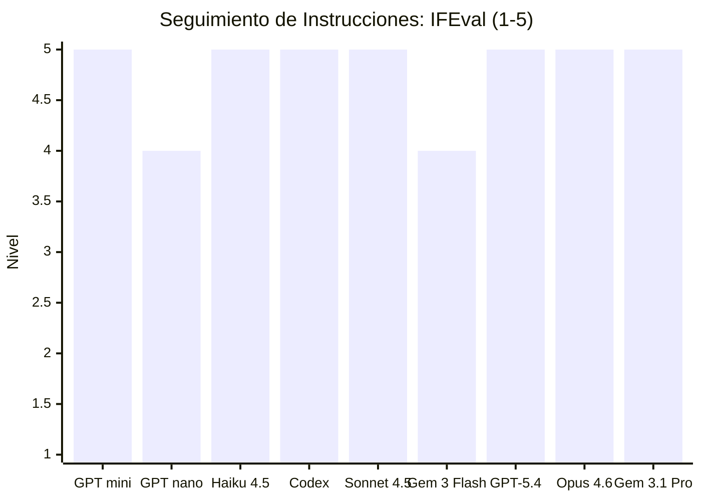
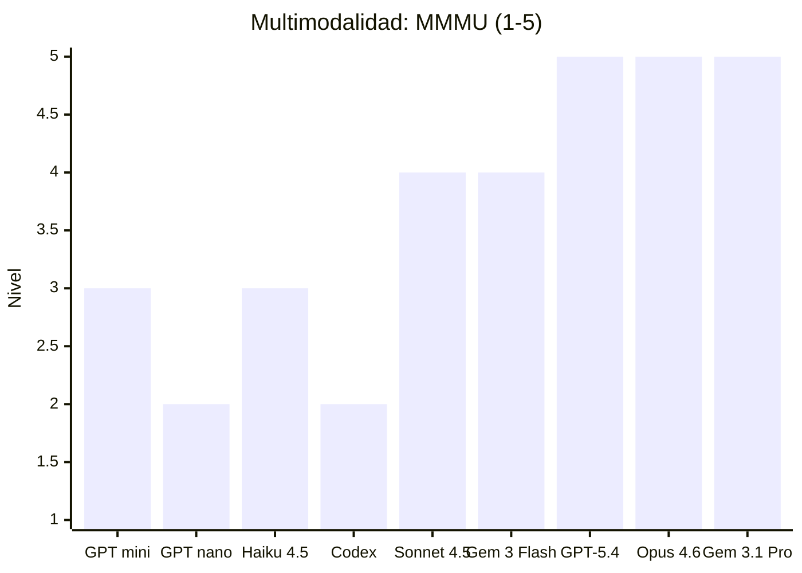

# Modelos de IA en Agentes: Guía Completa

> **Última actualización:** 12 de Abril, 2026

Esta guía explica desde cero qué son los modelos de lenguaje que alimentan a los agentes de IA, cómo se diferencian entre sí, y qué significa cada término técnico que aparece en documentación, configuraciones y marketplaces. El objetivo es que puedas elegir el modelo correcto para cada tarea con criterio técnico, no por inercia.

---

## ¿Qué es un modelo de lenguaje?

Un modelo de lenguaje (LLM, *Large Language Model*) es el motor de razonamiento que está detrás del agente. Cuando escribes un prompt y el agente responde, ese procesamiento ocurre dentro del modelo. Los agentes (Claude Code, Gemini CLI, Cursor, etc.) son la interfaz — el modelo es la inteligencia.

Actualmente los proveedores dominantes en el ecosistema de agentes de software son:

| Proveedor | Familia de modelos | Documentación oficial |
| :--- | :--- | :--- |
| **OpenAI** | GPT-5.x | developers.openai.com |
| **Anthropic** | Claude 4.x | platform.claude.com |
| **Google** | Gemini 2.5.x – 3.x | ai.google.dev |

> [!NOTE]
> Esta lista refleja el ecosistema actual (Abril 2026). El mercado evoluciona — nuevos proveedores aparecerán y los existentes lanzarán generaciones más avanzadas. Los conceptos de esta guía aplican independientemente del proveedor.

---

## El Vocabulario que Todo el Mundo Asume que Ya Sabes

Antes de evaluar qué modelo elegir, es fundamental dominar el vocabulario técnico universal que define cómo "piensan" y operan estas IAs.

### Tokens: Por Qué Cada Palabra que le Escribes a tu Agente Tiene un Precio

Un **token** no es estrictamente una letra, ni una sílaba, ni una palabra entera. Es la **unidad subatómica de procesamiento** que el modelo utiliza para asimilar el código y el lenguaje. El modelo no lee párrafos; lee secuencias de tokens generadas por su *tokenizador* interno.

Para tener una noción matemática en escenarios reales:
- **Texto:** ~1 palabra en inglés equivale a ~1.3 tokens.
- **Documentación:** ~750 palabras consumen cerca de 1,000 tokens.
- **Software:** 1,000 líneas de código en Python o TypeScript rondan entre 3,000 y 4,000 tokens.

Dominar el concepto de token es vital porque impacta directamente en la arquitectura de tus agentes por dos razones:
1. **Facturación (Costo):** Los proveedores calculan el precio basándose en dos métricas: tarifa por millón de tokens de entrada (*input*) y tarifa por millón de tokens de salida (*output*).
2. **Capacidad (Límite):** Todo modelo posee una restricción arquitectónica sobre cuántos tokens puede procesar en una sola interacción fluida. A esto se le llama **Ventana de Contexto** (*Context Window*).

### Ventana de Contexto: Por Qué tu Agente se Vuelve más Tonto Cuanto más le Hablas

La **Ventana de Contexto** (*Context Window*) es el volumen máximo de tokens que el modelo puede retener y analizar simultáneamente en una sola interacción. Es el sumatorio estricto de múltiples componentes: el *System Prompt* oculto de tu agente + el historial de la conversación + los archivos que adjuntas + la propia respuesta que el modelo está generando.

```text
Evolución de las Ventanas de Contexto (2022-2026):

GPT-3.5 (2022)         :  4K tokens   = ~3,000 palabras
GPT-4 8K (2023)        :  8K tokens   = ~6,000 palabras
Claude 1 (2023)        : 100K tokens  = ~75,000 palabras
Gemini 1.5 Pro (2024)  :   1M tokens  = Un monorepo de código base
GPT-5.4 (2026)         :   1M tokens  = Análisis estructural de codebases
Gemini 3.1 Pro (2026)  :   1M+ tokens = Fusión multimodal (documentos, video, audio y código)
```

#### ¿Qué sucede cuando saturas la Ventana de Contexto?

Uno de los errores más comunes al trabajar con agentes es creer que "adjuntar más archivos siempre es mejor". Cuando comienzas a llenar o rebasar el límite de la ventana, el sistema no suele fallar con un error obvio; en su lugar, sufre una **degradación silenciosa**:

1. **Pérdida de Atención (Attention Decay):** Los LLMs sufren del efecto *"Lost in the Middle"*. Si le envías 100 archivos, el modelo recordará perfectamente el primero y el último, pero ignorará las instrucciones críticas atrapadas en el medio.
2. **Alucinación Inducida:** Al saturar su capacidad de análisis, el agente "olvida" las normativas de tu proyecto (como qué versión de React usas) y empieza a inventar código genérico basado en sus datos de entrenamiento.
3. **Truncamiento (Recorte):** En herramientas modernas, cuando alcanzas el límite, el agente orquestador elimina automáticamente los mensajes más antiguos del historial para que el nuevo mensaje quepa. Esto causa que el agente olvide por qué estaban debatiendo cierto error hace 5 interacciones.
4. **Hemorragia de Costos:** Cada vez que le pides corregir un typo a tu agente, el sistema *re-envía* todo el historial anterior sumado a los archivos adjuntos. Si tu contexto es gigante de forma innecesaria, facturarás miles de tokens extras por una tarea trivial.

> [!IMPORTANT]
> **No confundas la Ventana de Contexto con Memoria Persistente.** La Ventana de Contexto es estrictamente episódica; se desvanece en cuanto cierras la sesión. Sin mecanismos de arquitectura de contexto (como inyectar un archivo `AGENTS.md` o usar cachés), tu agente sufre de amnesia severa y comienza cada nueva sesión sin conocimiento previo de tu repositorio.

### Temperatura: El Parámetro que Convierte un Programador en Poeta (y Arruina tu CI/CD)

La **Temperatura** es el parámetro que ajusta el nivel de aleatoriedad (entropía) en la selección de tokens que realiza el modelo. Técnicamente, altera la distribución de probabilidades antes de que el motor decida cuál es el siguiente fragmento, aplanando o intensificando la creatividad de la respuesta.

```text
Escala Práctica de Temperatura:

0.0 a 0.2  → Determinismo extremo. El modelo prioriza el token más probable. Obligatorio para código, matemáticas y parsing estricto de JSON.
0.5 a 0.7  → Equilibrio (Default). Lenguaje natural, fluido pero coherente. Excelente para documentación técnica y resúmenes de PRs.
1.0 a 1.5+ → Alta entropía. Caminos lógicos divergentes. Excelente para brainstorming, pero letal para la programación algorítmica.
```

En orquestación de agentes operativos o workflows *headless* (CI/CD), utilizar una **temperatura en cero absoluto (0.0)** garantiza que, ante el mismo prompt y contexto, el agente aplicará el parche exactamente de la misma manera en cada ejecución, eliminando variabilidad estadística.

> [!NOTE]
> **La Desaparición de la Temperatura:** En las familias modernas enfocadas exclusivamente al razonamiento profundo (como los modelos GPT-5.x cuando su configuración *thinking* está activa), el parámetro `temperature` **no puede ser alterado manualmente**. La exploración heurística requerida para la lógica algorítmica es controlada automáticamente por el motor interno y se parametriza a través de `reasoning.effort`.

*Fuente: [OpenAI: GPT-5.4 Parameter Compatibility](https://developers.openai.com/api/docs/guides/latest-model#gpt-54-parameter-compatibility)*


## Thinking: Por Qué el Mismo Modelo Falla un Bug Fácil y Resuelve uno Imposible

Imagina pedirle a un ingeniero que diseñe una arquitectura compleja hablando muy rápido y sin dejarle anotar nada en un papel. Probablemente el resultado esté lleno de fallos estructurales o callejones sin salida. Sin embargo, si le das una hora, papel y la libertad de tachar y volver a calcular antes de darte los planos finales, el diseño será un éxito.

Esto es exactamente lo que hace el concepto de **Thinking** (Razonamiento). En lugar de "escupir" el primer pedazo de código que se le viene a la red neuronal, los modelos modernos generan un "borrador privado" oculto. En este borrador, la IA analiza el problema paso a paso, diagrama opciones lógicas, e **incluso detecta y corrige sus propios errores antes de mostrarte la respuesta final**. 

Es una "voz interior" que incrementa brutalmente la calidad y la precisión geométrica del código que te entrega el agente.

Los niveles de thinking mas comunes son: `low`, `medium`, `hight`, muchos agentes usualmente ya traen preconfigurada un nivel thinking `medium` en el llm.

### Niveles de Thinking por Proveedor

Para que tu agente utilice este "tiempo de reflexión adicional", necesitas habilitarlo explícitamente en tu archivo de configuración (como tu `settings.json` o parámetro de red). Cada proveedor expone este mecanismo con nombres distintos, pero el principio de "cuaderno de borrador" es el mismo.

Aquí tienes la configuración técnica de cada uno:

**OpenAI (GPT-5.x) — `reasoning.effort`**

```json
{
  "model": "gpt-5.4",
  "reasoning": {
    "effort": "medium"
  }
}
```

| Nivel | Escenario de uso | Impacto en latencia |
| :--- | :--- | :--- |
| `none` | Formateo, parsing de datos, respuestas directas | Sin overhead |
| `low` | Completar templates, generación de código predecible | Bajo |
| `medium` | Codificación diaria, revisión de PRs, documentación (default) | Moderado |
| `high` | Bugs con múltiples archivos involucrados, diseño de arquitectura | Alto |
| `xhigh` | Solo disponible en GPT-5.3-Codex. Problemas de máxima complejidad algorítmica | Muy alto |

> [!NOTE]
> Con `reasoning.effort` activo en cualquier nivel distinto de `none`, el parámetro `temperature` queda bloqueado. El motor de reasoning gestiona la variabilidad internamente.

*Fuente: [OpenAI: Latest Model Guide – Reasoning Effort](https://developers.openai.com/api/docs/guides/latest-model)*

---

**Google (Gemini 3.x) — `thinkingConfig.thinkingLevel`**

```json
{
  "model": "gemini-3.1-pro-preview",
  "generationConfig": {
    "thinkingConfig": {
      "thinkingLevel": "high"
    }
  }
}
```

| Nivel | Escenario de uso | Impacto en latencia |
| :--- | :--- | :--- |
| `minimal` | Respuestas instantáneas de alto volumen, tareas triviales | Mínimo |
| `low` | Consultas simples, resúmenes de texto corto | Bajo |
| `medium` | Codificación general, análisis de documentos | Moderado |
| `high` | Default de Gemini 3. Agentic workflows, razonamiento complejo | Alto |

> [!NOTE]
> Gemini 3 activa `high` por defecto en todos sus modelos Pro. Esto es relevante para pipelines de Tool Use encadenado, ya que el overhead de *thinking* incrementa la latencia entre herramientas consecutivas.

*Fuente: [Google: Gemini 3 Developer Guide – Thinking Level](https://ai.google.dev/gemini-api/docs/gemini-3)*

---

**Anthropic (Claude 4.x) — Extended Thinking**

Claude diferencia entre dos modalidades de *thinking*. Ambas son transparentes al usuario en el formato de respuesta, que incluye un bloque `thinking` separado del bloque de respuesta final:

- **Extended Thinking:** El modelo siempre genera un bloque de razonamiento de profundidad máxima antes de responder. Ideal para tareas con alta complejidad estructural donde la consistencia del razonamiento es crítica.
- **Adaptive Thinking:** El modelo evalúa la complejidad del prompt y ajusta automáticamente la profundidad del bloque de razonamiento. Más eficiente en términos de costos para sesiones de trabajo mixto donde se alternan tareas simples y complejas.

*Fuentes: [Anthropic: Extended Thinking](https://platform.claude.com/docs/en/build-with-claude/extended-thinking) | [Anthropic: Adaptive Thinking](https://platform.claude.com/docs/en/build-with-claude/adaptive-thinking)*

---

## Ventana de contexto larga: qué cambia con 1 millón de tokens

Con ventanas pequeñas, los agentes necesitaban técnicas como RAG (*Retrieval Augmented Generation*) para procesar documentos grandes: el sistema buscaba los fragmentos relevantes y los inyectaba en el prompt. Con ventanas de 1M tokens, ese overhead de arquitectura ya no es obligatorio para muchos casos.

Qué representa 1 millón de tokens en la práctica:

```text
1M tokens equivale aproximadamente a:
  - 50,000 lineas de codigo (80 caracteres por linea)
  - 8 novelas de extension media en ingles
  - Transcripciones de 200+ episodios de podcast
  - El contenido completo de un repositorio mediano con tests y docs
```

*Fuente: [Google: Long Context Guide](https://ai.google.dev/gemini-api/docs/long-context)*

### Cuándo todavía necesitas RAG con ventanas grandes

La ventana grande tiene alta precisión para encontrar un dato específico en un texto largo. Pero la precisión baja cuando necesitas recuperar muchos datos simultáneamente. Para consultas de recuperación masiva y paralela (ej. buscar 50 configuraciones diferentes en 1,000 archivos), RAG sigue siendo la arquitectura correcta.

> [!TIP]
> **Context Caching** es la optimización económica clave para ventanas largas. Si tienes documentos que reutilizas en muchas consultas (ej. la documentación de un SDK o el `AGENTS.md` del proyecto), puedes cachear esos tokens y pagar una tarifa de almacenamiento por hora en lugar del costo completo de entrada en cada request. Disponible en los tres proveedores principales bajo distintos nombres: *Prompt Caching* (OpenAI y Anthropic), *Context Caching* (Google).

---

## Modelos por proveedor: catálogo activo

### OpenAI — Familia GPT-5

La familia GPT-5 unifica en un solo modelo lo que antes estaba separado entre modelos de chat y modelos de razonamiento (la serie o-series).

**Modelos de texto activos (Abril 2026):**

| Modelo | Cuándo usarlo | Context Window | Estado |
| :--- | :--- | :---: | :--- |
| `gpt-5.4` | Tu tarea mas importante del dia: codigo complejo, decisiones de arquitectura, analisis | 1M tokens | ✅ Activo |
| `gpt-5.4-pro` | Cuando `gpt-5.4` no es suficiente y necesitas que el modelo piense mas tiempo | 1M tokens | ✅ Activo |
| `gpt-5.3-codex` | Terminal, CI/CD, generacion de codigo puro sin contexto de negocio | 256K tokens | ✅ Activo |
| `gpt-5.4-mini` | Subagentes, parseo de datos, tareas rapidas de mediana complejidad | 128K tokens | ✅ Activo |
| `gpt-5.4-nano` | Tareas repetitivas de muy bajo costo: categorizar, etiquetar, formatear | No publicado | ✅ Activo |
| `gpt-5.2` | Tareas heredadas de generaciones previas | 128K tokens | ⚠️ **Deprecado** (Junio 2026) |
| `gpt-4.1` / `o3` / `o4-mini` | Alternativas antiguas de razonamiento y uso general | 128K tokens | ⚠️ **Deprecado** (Reemplazado) |

**Parámetros clave de GPT-5.4:**

```json
{
  "model": "gpt-5.4",
  "reasoning": { "effort": "medium" },
  "text": { "verbosity": "low" }
}
```

- `reasoning.effort` — profundidad del thinking: `none`, `low`, `medium`, `high`, `xhigh`
- `text.verbosity` — extension de la respuesta: `low`, `medium`, `high`
- `temperature` — solo disponible cuando `reasoning.effort = "none"`

*Fuente: [OpenAI: GPT-5.4 Guide](https://developers.openai.com/api/docs/guides/latest-model)*

**Modelos especializados de OpenAI:**

| Modelo | Para qué sirve |
| :--- | :--- |
| `gpt-image-1` | Generar y editar imagenes desde texto |
| `whisper-1` | Convertir audio y voz a texto |
| `tts-1` / `tts-1-hd` | Convertir texto a voz |
| `text-embedding-3-large` | Busqueda semantica y sistemas RAG |
| `omni-moderation-latest` | Detectar contenido inapropiado en texto e imagenes |

*Fuente: [OpenAI: Models Reference](https://developers.openai.com/api/docs/models)*

---

### Anthropic — Familia Claude 4

Anthropic nombra sus modelos con tres rangos: **Haiku** (más rápido y económico) → **Sonnet** (equilibrado) → **Opus** (más capaz). El número después del nombre indica la generación.

**Modelos activos (Abril 2026):**

| Modelo (API ID) | Cuándo usarlo | Context Window | Estado |
| :--- | :--- | :---: | :--- |
| `claude-opus-4-6` | Problemas que requieren logica profunda: razonamiento complejo, matematicas, decisiones criticas | 200K tokens | ✅ Activo |
| `claude-sonnet-4-5` | Codificacion de produccion dia a dia, refactorizaciones, revision de PRs | 200K tokens | ✅ Activo |
| `claude-haiku-4-5` | Subagentes de busqueda, generar JSDoc, parsear APIs, respuestas inmediatas | 200K tokens | ✅ Activo |

> [!IMPORTANT]
> Todos los modelos Claude 4 comparten 200K tokens de ventana. La diferencia entre ellos es la capacidad de razonamiento y el costo de inferencia — no el tamaño de contexto.

**Característica distintiva de Claude:** En la Message Batches API, Opus 4.6 y Sonnet 4.5 admiten hasta **300K tokens de salida** usando el header beta `output-300k-2026-03-24`. Útil cuando necesitas generar documentación extensa o refactorizaciones masivas en un solo request.

*Fuente: [Anthropic: Models Overview](https://platform.claude.com/docs/en/about-claude/models/overview)*

---

### Google — Familia Gemini 2.5 y 3.x

Google tiene la oferta más amplia, con modelos de texto, imagen, video, audio y robótica. Para agentes de software, los modelos de texto son los relevantes.

**Modelos de texto activos (Abril 2026):**

| Modelo | Cuándo usarlo | Context Window | Estado |
| :--- | :--- | :---: | :--- |
| `gemini-3.1-pro-preview` | Leer repositorios enteros, analizar PDFs y documentos masivos, agentic workflows largos | 1M tokens+ | ✅ Preview |
| `gemini-3-flash-preview` | Codificacion y analisis con calidad alta sin pagar el precio del Pro | 1M tokens | ✅ Preview |
| `gemini-3.1-flash-lite-preview` | Tareas de altisimo volumen donde el costo es el factor critico | 1M tokens | ✅ Preview |
| `gemini-2.5-pro` | Produccion estable: razonamiento complejo sin depender de previews | 1M tokens | ✅ Estable |
| `gemini-2.5-flash` | Produccion estable: velocidad y costo balanceados | 1M tokens | ✅ Estable |
| `gemini-2.5-flash-lite` | Produccion estable + maximo ahorro de costo | 1M tokens | ✅ Estable |
| `gemini-3-pro-preview` | Versión previa de razonamiento | 1M tokens | ❌ **Cerrado** (usa 3.1) |
| `gemini-2.0-flash` / `flash-lite` | Generación flash anterior | 1M tokens | ⚠️ **Deprecado** |

**Ciclos de vida de los modelos Gemini:**

| Canal | Qué significa | Recomendacion |
| :--- | :--- | :--- |
| `stable` | Version fija, sin cambios inesperados | Usar en produccion |
| `preview` | Funcional, con aviso de 2 semanas antes de cambios | Aceptable en produccion controlada |
| `latest` | Se actualiza automaticamente con cada nueva version | No usar en produccion |
| `experimental` | Acceso anticipado, puede romperse | Solo para pruebas y desarrollo |

*Fuentes: [Google: All Models Reference](https://ai.google.dev/gemini-api/docs/models) | [Google: Gemini 3 Developer Guide](https://ai.google.dev/gemini-api/docs/gemini-3)*

**Modelos especializados de Google para agentes:**

| Modelo | Para qué sirve |
| :--- | :--- |
| `gemini-3.1-flash-live-preview` | Conversacion en tiempo real con voz (Live API) |
| `deep-research-pro-preview` | Investigar un tema en cientos de fuentes y generar un reporte citado |
| `computer-use-preview` | Controlar una computadora: hacer click, escribir, navegar en un browser |
| `gemini-embedding-2-preview` | Busqueda semantica sobre texto, imagenes, video y audio combinados |

*Fuente: [Google: Gemini 3 Developer Guide](https://ai.google.dev/gemini-api/docs/gemini-3)*

---

## Qué modelo usar según tu tarea: referencia cruzada entre proveedores

Esta es la sección práctica. Aquí los modelos están agrupados por lo que necesitas hacer, sin importar el proveedor.

### Diseñar arquitectura y resolver bugs complejos

Problemas que involucran múltiples archivos, decisiones de trade-off, o razonamiento en cadena antes de escribir una línea de código.

| Modelo | Proveedor | Por qué es el indicado |
| :--- | :--- | :--- |
| `gpt-5.4` / `gpt-5.4-pro` | OpenAI | Reasoning profundo + 1M tokens para leer todo el codebase |
| `claude-opus-4-6` | Anthropic | El mejor de Anthropic para logica formal y decisiones criticas |
| `gemini-3.1-pro-preview` | Google | Lee repositorios, PDFs y diagramas juntos en una sola consulta |

---

### Codificación diaria de producción

Implementar features, refactorizar módulos, escribir tests, resolver bugs acotados, hacer code review.

| Modelo | Proveedor | Por qué es el indicado |
| :--- | :--- | :--- |
| `gpt-5.3-codex` | OpenAI | Optimizado especificamente para entornos de terminal y agentes de codigo |
| `claude-sonnet-4-5` | Anthropic | El mejor balance calidad/costo para codificacion activa dia a dia |
| `gemini-3-flash-preview` | Google | Calidad cercana al Pro a precio de modelo rapido |

---

### Subagentes de búsqueda, parseo y alto volumen

Subagentes de solo lectura, parseo de JSON/YAML, búsqueda en logs, generar JSDoc, formatear respuestas de APIs, tareas repetitivas donde el costo por llamada importa.

| Modelo | Proveedor | Por qué es el indicado |
| :--- | :--- | :--- |
| `gpt-5.4-mini` | OpenAI | Equilibrio economia/capacidad dentro de GPT-5 |
| `gpt-5.4-nano` | OpenAI | El mas barato de OpenAI para micro-tareas de un solo paso |
| `claude-haiku-4-5` | Anthropic | El mas rapido de Anthropic, excelente en tool use y MCP |
| `gemini-3.1-flash-lite-preview` | Google | 1M context + minimo costo = ideal para procesar miles de archivos |

---

### Investigación profunda multi-fuente

Investigar un tema técnico en muchos documentos, comparar alternativas, sintetizar información de múltiples fuentes con citas verificables.

| Modelo | Proveedor | Por qué es el indicado |
| :--- | :--- | :--- |
| `deep-research-pro-preview` | Google | Agente especializado que busca, navega y cita automaticamente |
| `gpt-5.4` con `web_search` activado | OpenAI | Busqueda iterativa sobre muchas fuentes web en un solo workflow |

*Fuente: [Google: Deep Research Agent](https://ai.google.dev/gemini-api/docs/deep-research)*

---

### Procesar documentos y repositorios masivos

Leer y analizar bases de código completas, suites de documentación, transcripciones, archivos PDF técnicos, o cualquier input cuyo volumen sea el factor dominante.

| Modelo | Proveedor | Por qué es el indicado |
| :--- | :--- | :--- |
| `gemini-3.1-pro-preview` | Google | 1M+ tokens y lee texto, PDF, video y audio en la misma consulta |
| `gpt-5.4` | OpenAI | 1M tokens con posibilidad de controlar UI via `computer_use` |

*Fuente: [Google: Long Context Guide](https://ai.google.dev/gemini-api/docs/long-context)*

---

### Testing: generar y revisar tests

Generar suites de tests unitarios, de integración, snapshots, fixtures, y validar cobertura.

| Modelo | Proveedor | Por qué es el indicado |
| :--- | :--- | :--- |
| `claude-sonnet-4-5` | Anthropic | Entiende el codigo del modulo y genera tests de caja blanca precisos |
| `gpt-5.3-codex` | OpenAI | Excelente para generar tests directamente desde el terminal |
| `gemini-3-flash-preview` | Google | Rapido y economico para generar fixtures y datos de prueba en volumen |

---

## Guía de selección rápida

Si no sabes por dónde empezar:

```text
Tengo que disenar algo complejo o resolver un bug dificil
  -> gpt-5.4-pro / claude-opus-4-6 / gemini-3.1-pro-preview

Tengo que codificar features o hacer code review
  -> claude-sonnet-4-5 / gpt-5.3-codex / gemini-3-flash-preview

Configuro un subagente de busqueda o parseo de datos
  -> claude-haiku-4-5 / gemini-3.1-flash-lite-preview / gpt-5.4-mini

Necesito analizar un repositorio o una suite de documentos completa
  -> gemini-3.1-pro-preview (1M+ tokens, lee texto, PDF, video y audio)

Investigo un tema tecnico consultando muchas fuentes
  -> deep-research-pro-preview (Google) / gpt-5.4 + web search (OpenAI)

Es una tarea repetitiva, trivial y de altisimo volumen
  -> gpt-5.4-nano / gemini-3.1-flash-lite-preview

Genero o reviso una suite de tests
  -> claude-sonnet-4-5 / gpt-5.3-codex
```

---

## Modelos que ya no debes usar

Los siguientes modelos aún aparecen en configuraciones antiguas, scripts de CI/CD o tutoriales desactualizados. Si los ves en tu proyecto, migra antes de que rompan tu pipeline.

> [!CAUTION]
> **GPT-5.2** — OpenAI ha anunciado el retiro de este modelo para **Junio 2026**. Cualquier pipeline que lo use romperá en esa fecha. Reemplaza con `gpt-5.4` con la configuración equivalente (`reasoning.effort: "none"` para paridad con GPT-4.1, `"medium"` para paridad con o3).

> [!WARNING]
> **Gemini 3 Pro Preview** (primera versión) — El endpoint `gemini-3-pro-preview` ya fue cerrado (*shut down*). El sucesor activo es `gemini-3.1-pro-preview`. Actualiza cualquier referencia en scripts o configs.

> [!WARNING]
> **Gemini 2.0 Flash / Flash-Lite** — Marcados como *deprecated* en la documentación de Google. Reemplaza con `gemini-2.5-flash` (stable) para producción.

> [!WARNING]
> **GPT-4.1 / o3 / o4-mini** — Reemplazados por la familia GPT-5. La guía oficial de OpenAI establece las equivalencias directas: `gpt-5.4` + `effort: "none"` reemplaza a `gpt-4.1`; `gpt-5.4-mini` reemplaza a `o4-mini`.

*Fuentes: [OpenAI: Deprecations](https://developers.openai.com/api/docs/deprecations) | [Google: Deprecations](https://ai.google.dev/gemini-api/docs/deprecations) | [Anthropic: Model Deprecations](https://platform.claude.com/docs/en/about-claude/model-deprecations)*

---

## Benchmarks y Evaluación de Modelos

Para facilitar la evaluación de los modelos —indispensable para orquestar agentes que optimicen coste, velocidad y latencia— los dividimos en dos visiones: comparativa cruzada (todos los modelos bajo las mismas categorías de uso) y comparativa interna por proveedor (para cuando necesitas quedarte con una sola familia).

**Leyenda de indicadores:**

| Indicador | Nivel |
| :---: | :--- |
| 🟢 | Excelente |
| 🔵 | Bueno |
| 🟡 | Regular |
| 🔴 | Malo |
| ⚫ | Muy Malo |

---

### Comparativa por Categoría (Todos los modelos)

Las tablas están divididas por grupo de acción para facilitar la lectura.

#### Grupo A — Desarrollo de Código (Código · Testing)

Capacidad para generar código, completar funciones, implementar features, y escribir suites de tests unitarios, de integración y snapshots.

| Modelo | Código | Testing |
| :--- | :---: | :---: |
| GPT-5.4 / Pro | 🟢 Excelente | 🟢 Excelente |
| GPT-5.3-Codex | 🟢 Excelente | 🟢 Excelente |
| GPT-5.4-mini | 🔵 Bueno | 🔵 Bueno |
| GPT-5.4-nano | 🟡 Regular | 🟡 Regular |
| Claude Opus 4.6 | 🟢 Excelente | 🟢 Excelente |
| Claude Sonnet 4.5 | 🟢 Excelente | 🟢 Excelente |
| Claude Haiku 4.5 | 🔵 Bueno | 🔵 Bueno |
| Gemini 3.1 Pro | 🟢 Excelente | 🟢 Excelente |
| Gemini 3 Flash | 🔵 Bueno | 🔵 Bueno |
| Gemini 3.1 Flash-Lite | 🟡 Regular | 🟡 Regular |

*Fuente: [LiveCodeBench](https://livecodebench.github.io/leaderboard.html) | [SWE-bench Verified](https://www.swebench.com)*

---

#### Grupo B — Análisis e Inteligencia (Razonamiento · Documentación)

Razonamiento: decisiones de arquitectura, bugs complejos con múltiples archivos, trade-offs y lógica en cadena.
Documentación: generación de JSDoc, README, comentarios técnicos, changelogs.

| Modelo | Razonamiento | Documentación |
| :--- | :---: | :---: |
| GPT-5.4 / Pro | 🟢 Excelente | 🟢 Excelente |
| GPT-5.3-Codex | 🔵 Bueno | 🔵 Bueno |
| GPT-5.4-mini | 🟡 Regular | 🔵 Bueno |
| GPT-5.4-nano | 🔴 Malo | 🟡 Regular |
| Claude Opus 4.6 | 🟢 Excelente | 🟢 Excelente |
| Claude Sonnet 4.5 | 🔵 Bueno | 🟢 Excelente |
| Claude Haiku 4.5 | 🟡 Regular | 🟢 Excelente |
| Gemini 3.1 Pro | 🟢 Excelente | 🟢 Excelente |
| Gemini 3 Flash | 🔵 Bueno | 🔵 Bueno |
| Gemini 3.1 Flash-Lite | 🔴 Malo | 🟡 Regular |

*Fuente: [LiveCodeBench](https://livecodebench.github.io/leaderboard.html) | [Google: Gemini 3 Developer Guide](https://ai.google.dev/gemini-api/docs/gemini-3) | [Anthropic: Extended Thinking](https://platform.claude.com/docs/en/build-with-claude/extended-thinking)*

---

#### Grupo C — Datos e Integración de Herramientas (Búsqueda/Parseo · Tool Use / MCP)

Búsqueda/Parseo: lectura de logs, transformación de JSON/YAML, consultas a APIs externas.
Tool Use/MCP: precisión al invocar herramientas, function calling, llamadas encadenadas.

| Modelo | Búsqueda / Parseo | Tool Use (MCP) |
| :--- | :---: | :---: |
| GPT-5.4 / Pro | 🔵 Bueno | 🔵 Bueno |
| GPT-5.3-Codex | 🔵 Bueno | 🟢 Excelente |
| GPT-5.4-mini | 🟢 Excelente | 🟢 Excelente |
| GPT-5.4-nano | 🔵 Bueno | 🔵 Bueno |
| Claude Opus 4.6 | 🔵 Bueno | 🔵 Bueno |
| Claude Sonnet 4.5 | 🔵 Bueno | 🟢 Excelente |
| Claude Haiku 4.5 | 🟢 Excelente | 🟢 Excelente |
| Gemini 3.1 Pro | 🟢 Excelente | 🔵 Bueno |
| Gemini 3 Flash | 🟢 Excelente | 🟢 Excelente |
| Gemini 3.1 Flash-Lite | 🔵 Bueno | 🔵 Bueno |

> [!NOTE]
> Los modelos de maximo razonamiento (Opus, GPT-5.4 con `effort: "high"`, Gemini 3.1 Pro) obtienen 🔵 Bueno en Tool Use porque el thinking interno aumenta la latencia en cadenas de tool calls encadenadas, no porque fallen en ejecutarlas.

*Fuente: [BFCL – Berkeley Function Calling Leaderboard](https://gorilla.cs.berkeley.edu/leaderboard.html) | [OpenAI: GPT-5.4 Parameter Compatibility](https://developers.openai.com/api/docs/guides/latest-model#gpt-54-parameter-compatibility) | [Anthropic: Tool Use Guide](https://platform.claude.com/docs/en/build-with-claude/tool-use) | [Google: Function Calling Guide](https://ai.google.dev/gemini-api/docs/function-calling)*

---

### Comparativa Interna por Proveedor

#### OpenAI — Familia GPT-5

**Grupo A — Desarrollo de Código**

| Modelo | Context Window | Código | Testing |
| :--- | :---: | :---: | :---: |
| GPT-5.4 / Pro | 1M | 🟢 Excelente | 🟢 Excelente |
| GPT-5.3-Codex | 256K | 🟢 Excelente | 🟢 Excelente |
| GPT-5.4-mini | 128K | 🔵 Bueno | 🔵 Bueno |
| GPT-5.4-nano | Sin publicar | 🟡 Regular | 🟡 Regular |

**Grupo B — Análisis e Inteligencia**

| Modelo | Razonamiento | Documentación |
| :--- | :---: | :---: |
| GPT-5.4 / Pro | 🟢 Excelente | 🟢 Excelente |
| GPT-5.3-Codex | 🔵 Bueno | 🔵 Bueno |
| GPT-5.4-mini | 🟡 Regular | 🔵 Bueno |
| GPT-5.4-nano | 🔴 Malo | 🟡 Regular |

**Grupo C — Datos e Integración de Herramientas**

| Modelo | Búsqueda / Parseo | Tool Use (MCP) |
| :--- | :---: | :---: |
| GPT-5.4 / Pro | 🔵 Bueno | 🔵 Bueno |
| GPT-5.3-Codex | 🔵 Bueno | 🟢 Excelente |
| GPT-5.4-mini | 🟢 Excelente | 🟢 Excelente |
| GPT-5.4-nano | 🔵 Bueno | 🔵 Bueno |

> [!NOTE]
> GPT-5.3-Codex es la mejor opcion para Tool Use dentro de la familia porque no activa reasoning por defecto, manteniendo compatibilidad total con function calling. GPT-5.4 con `reasoning.effort: "high"` pierde soporte de `temperature` pero mantiene function calling con mayor latencia.

*Fuente: [OpenAI: Models Reference](https://developers.openai.com/api/docs/models) | [OpenAI: GPT-5.4 Guide](https://developers.openai.com/api/docs/guides/latest-model)*

---

#### Anthropic — Familia Claude 4

**Grupo A — Desarrollo de Código**

| Modelo | Context Window | Código | Testing |
| :--- | :---: | :---: | :---: |
| Claude Opus 4.6 | 200K | 🟢 Excelente | 🟢 Excelente |
| Claude Sonnet 4.5 | 200K | 🟢 Excelente | 🟢 Excelente |
| Claude Haiku 4.5 | 200K | 🔵 Bueno | 🔵 Bueno |

**Grupo B — Análisis e Inteligencia**

| Modelo | Razonamiento | Documentación |
| :--- | :---: | :---: |
| Claude Opus 4.6 | 🟢 Excelente | 🟢 Excelente |
| Claude Sonnet 4.5 | 🔵 Bueno | 🟢 Excelente |
| Claude Haiku 4.5 | 🟡 Regular | 🟢 Excelente |

**Grupo C — Datos e Integración de Herramientas**

| Modelo | Búsqueda / Parseo | Tool Use (MCP) |
| :--- | :---: | :---: |
| Claude Opus 4.6 | 🔵 Bueno | 🔵 Bueno |
| Claude Sonnet 4.5 | 🔵 Bueno | 🟢 Excelente |
| Claude Haiku 4.5 | 🟢 Excelente | 🟢 Excelente |

> [!NOTE]
> Todos los modelos Claude 4 comparten la misma ventana de 200K tokens. La documentacion oficial de Anthropic recomienda Haiku para *high-volume tasks* y subagentes de solo lectura por su velocidad y precision en tool use. Sonnet 4.5 es el modelo por defecto para codificacion activa.

*Fuente: [Anthropic: Models Overview](https://platform.claude.com/docs/en/about-claude/models/overview) | [Anthropic: Choosing a Model](https://platform.claude.com/docs/en/about-claude/models/choosing-a-model)*

---

#### Google — Familia Gemini 2.5 y 3.x

**Grupo A — Desarrollo de Código**

| Modelo | Context Window | Código | Testing |
| :--- | :---: | :---: | :---: |
| Gemini 3.1 Pro | 1M+ | 🟢 Excelente | 🟢 Excelente |
| Gemini 3 Flash | 1M | 🔵 Bueno | 🔵 Bueno |
| Gemini 3.1 Flash-Lite | 1M | 🟡 Regular | 🟡 Regular |
| Gemini 2.5 Pro (stable) | 1M | 🟢 Excelente | 🔵 Bueno |
| Gemini 2.5 Flash (stable) | 1M | 🔵 Bueno | 🔵 Bueno |

**Grupo B — Análisis e Inteligencia**

| Modelo | Razonamiento | Documentación |
| :--- | :---: | :---: |
| Gemini 3.1 Pro | 🟢 Excelente | 🟢 Excelente |
| Gemini 3 Flash | 🔵 Bueno | 🔵 Bueno |
| Gemini 3.1 Flash-Lite | 🔴 Malo | 🟡 Regular |
| Gemini 2.5 Pro (stable) | 🟢 Excelente | 🔵 Bueno |
| Gemini 2.5 Flash (stable) | 🔵 Bueno | 🔵 Bueno |

**Grupo C — Datos e Integración de Herramientas**

| Modelo | Búsqueda / Parseo | Tool Use (MCP) |
| :--- | :---: | :---: |
| Gemini 3.1 Pro | 🟢 Excelente | 🔵 Bueno |
| Gemini 3 Flash | 🟢 Excelente | 🟢 Excelente |
| Gemini 3.1 Flash-Lite | 🔵 Bueno | 🔵 Bueno |
| Gemini 2.5 Pro (stable) | 🟢 Excelente | 🔵 Bueno |
| Gemini 2.5 Flash (stable) | 🟢 Excelente | 🟢 Excelente |

> [!NOTE]
> La ventaja diferencial de Gemini es la combinacion de 1M tokens con multimodalidad nativa: puede leer codigo, PDFs, imagenes y diagramas en la misma consulta. Gemini 3 Flash tiene *function calling* documentado explicitamente como capacidad de produccion. Gemini 3.1 Pro activa *thinking* en nivel `high` por defecto, lo que impacta la velocidad en tool calls encadenadas.

*Fuente: [Google: All Models Reference](https://ai.google.dev/gemini-api/docs/models) | [Google: Function Calling Guide](https://ai.google.dev/gemini-api/docs/function-calling) | [Google: Gemini 3 Developer Guide](https://ai.google.dev/gemini-api/docs/gemini-3)*

---

### Comparativa Visual entre Modelos

Escala numérica: **1 = Muy Malo · 2 = Malo · 3 = Regular · 4 = Bueno · 5 = Excelente**.
Los modelos están agrupados por su perfil de uso real — no por proveedor.

---

#### Ligeros / Búsqueda (subagentes y alto volumen)

Optimizados para velocidad y alto volumen: parseo de JSON, llamadas MCP encadenadas, subagentes de solo lectura. Priorizan Tool Use y latencia baja sobre razonamiento profundo.

| Sigla | Modelo |
| :--- | :--- |
| GPT mini | GPT-5.4-mini (OpenAI) |
| GPT nano | GPT-5.4-nano (OpenAI) |
| Haiku 4.5 | Claude Haiku 4.5 (Anthropic) |
| Gem 3 Flash | Gemini 3 Flash (Google) |
| Flash-Lite | Gemini 3.1 Flash-Lite (Google) |





> [!TIP]
> Este es el grupo ideal para subagentes en pipelines: alta precisión en Tool Use a bajo costo. Gem 3 Flash es la excepción con razonamiento de nivel 4, lo que lo hace util en tareas de análisis de documentos largos además de búsquedas.

---

#### Workhorse / Día a Día (desarrollo interactivo)

El modelo que mantienes abierto mientras trabajas: refactorización activa, revisión de PRs, implementación de features y pair programming. Balance óptimo entre calidad, velocidad y Tool Use.

| Sigla | Modelo |
| :--- | :--- |
| Codex | GPT-5.3-Codex (OpenAI) |
| Sonnet 4.5 | Claude Sonnet 4.5 (Anthropic) |
| Gem 3.1 Pro | Gemini 3.1 Pro (Google) |





> [!TIP]
> Sonnet 4.5 es el modelo por defecto recomendado por Anthropic para sesiones de codificacion activa. Codex es la mejor opcion cuando el trabajo es 100% en terminal y CLI. Gem 3.1 Pro destaca cuando el contexto incluye documentos largos o imagenes ademas del codigo.

---

#### Máximo Esfuerzo (arquitectura y razonamiento crítico)

Se activan cuando el problema lo requiere: decisiones de arquitectura critica, deuda tecnica compleja, diseño de sistemas multi-componente. Maxima calidad, mayor latencia y costo por token.

| Sigla | Modelo |
| :--- | :--- |
| GPT-5.4 | GPT-5.4 / Pro (OpenAI) |
| Opus 4.6 | Claude Opus 4.6 (Anthropic) |





> [!NOTE]
> El Tool Use de nivel 4 (en lugar de 5) en ambos modelos no indica un fallo — es consecuencia directa del *thinking* interno activo. GPT-5.4 con `reasoning.effort: "high"` y Claude Opus con *extended thinking* aumentan la latencia entre tool calls encadenadas. Para pipelines de Tool Use puro, usa el grupo Workhorse.

*Fuentes de evaluaciones verificadas: [LLM-Stats Benchmarks](https://llm-stats.com/benchmarks) | [SWE-Bench Verified](https://llm-stats.com/benchmarks/swe-bench-verified) | [LiveCodeBench](https://livecodebench.github.io/leaderboard.html) | [BFCL](https://gorilla.cs.berkeley.edu/leaderboard.html)*
*(Investigación y datos actualizados al 12 de Abril, 2026)*

---

### Benchmarks por Categoría Especializada

Esta sección documenta tres capacidades adicionales que no entran en la comparativa de código: **Agentes autónomos**, **Escritura y seguimiento de instrucciones**, y **Multimodalidad**. Incluye los benchmarks verificados y una advertencia explícita sobre cuáles NO son confiables.

> [!WARNING]
> Existen docenas de benchmarks con nombres llamativos (MCP Universe, T2-Bench, AgentBench Pro, etc.) publicados por empresas sin revisión académica externa. Estos benchmarks suelen ser diseñados y ejecutados por el mismo proveedor del modelo, lo que introduce sesgo. Solo se documentan aquí benchmarks con **paper publicado en arXiv** y **datos independientes del proveedor evaluado**.

---

#### Agentes Autónomos

Capacidad del modelo para actuar de forma autónoma: planificar pasos, usar herramientas de forma encadenada, corregir errores propios y completar tareas sin intervención humana.

**Benchmark de referencia:** [BFCL – Berkeley Function Calling Leaderboard](https://gorilla.cs.berkeley.edu/leaderboard.html)

| Aspecto | Detalle |
| :--- | :--- |
| **Que mide** | Precision al invocar funciones y APIs: tipo de argumentos, orden correcto, manejo de errores |
| **Metodologia** | Problemas reales de GitHub ejecutados en entorno aislado, evaluados por ejecucion correcta |
| **Validacion academica** | Publicado y mantenido por UC Berkeley, independiente de los proveedores evaluados |
| **Por que es confiable** | Ejecuta el codigo realmente — no evalua si el modelo "dice" la respuesta correcta |
| **Limitacion** | Se enfoca en function calling, no en razonamiento multi-paso de alto nivel |



> [!NOTE]
> Los modelos ligeros (Haiku, mini, Flash) lideran en Tool Use per-call porque no activan thinking. Los modelos pesados (GPT-5.4, Opus, Gem 3.1 Pro) son superiores en **planificacion multi-paso** (encadenar 5+ herramientas con contexto compartido), aunque BFCL no mide eso directamente.

*Fuente: [BFCL Leaderboard](https://gorilla.cs.berkeley.edu/leaderboard.html) | [SWE-Bench Verified](https://llm-stats.com/benchmarks/swe-bench-verified) — ambos con paper en arXiv verificado*

---

#### Escritura y Seguimiento de Instrucciones

Capacidad del modelo para seguir instrucciones complejas con restricciones verificables: formato, longitud, tono, estructura, contenido que debe y debe evitar.

**Benchmark de referencia:** [IFEval – Instruction Following Evaluation](https://llm-stats.com/benchmarks/ifeval)

| Aspecto | Detalle |
| :--- | :--- |
| **Que mide** | Exactitud al cumplir 25 tipos de restricciones verificables en ~500 prompts |
| **Metodologia** | Las restricciones son objetivas: "escribe exactamente 3 parrafos", "no uses la palabra X", "usa formato JSON" |
| **Validacion academica** | Paper: [arXiv:2311.07911](https://arxiv.org/abs/2311.07911) — Google DeepMind, independiente |
| **Por que es confiable** | No depende de juicio humano subjetivo: la respuesta cumple o no cumple la restriccion |
| **Limitacion** | No mide calidad narrativa ni creatividad — solo obediencia a reglas explicitas |

> [!WARNING]
> No existe ningun benchmark con validacion academica amplia que mida **calidad creativa de escritura**. Los rankings de "best AI for writing" en sitios de terceros son evaluaciones subjetivas sin metodologia rigurosa. IFEval es el unico con paper peer-reviewed relevante para escritura tecnica y documentacion.



> [!NOTE]
> IFEval mide precision en instrucciones verificables. Todos los modelos de nivel Sonnet/Pro/Flash en adelante obtienen nivel alto. La diferencia real aparece en instrucciones contradictorias o de muy alta complejidad, donde los modelos de razonamiento pesado (Opus, GPT-5.4) mantienen coherencia durante mas pasos.

*Fuente: [IFEval Leaderboard](https://llm-stats.com/benchmarks/ifeval) | Paper: [arXiv:2311.07911](https://arxiv.org/abs/2311.07911) — actualizado al 12 de Abril, 2026*

---

#### Multimodalidad

Capacidad del modelo para procesar y razonar sobre imagenes, diagramas, capturas de pantalla, graficas y documentos visuales junto con texto.

**Benchmark de referencia:** [MMMU – Massive Multi-discipline Multimodal Understanding](https://llm-stats.com/benchmarks/mmmu)

| Aspecto | Detalle |
| :--- | :--- |
| **Que mide** | Razonamiento sobre 11,500 preguntas de examenes universitarios que incluyen imagenes, diagramas, formulas y tablas en 30 disciplinas |
| **Metodologia** | Preguntas de opcion multiple de exámenes reales: Arte, Ciencias, Medicina, Ingenieria, Humanidades |
| **Validacion academica** | Paper: [arXiv:2311.16502](https://arxiv.org/abs/2311.16502), citado por Google, OpenAI y Anthropic en sus propios reportes |
| **Por que es confiable** | Preguntas de nivel universitario, sin trampa posible con busqueda web, evaluacion objetiva de opcion multiple |
| **Limitacion** | No mide generacion de imagenes ni video — solo comprension visual |



> [!NOTE]
> Codex y modelos de texto puro obtienen nivel bajo porque no tienen capacidades visuales nativas. Gemini 3 Flash y Sonnet 4.5 tienen multimodalidad integrada pero de menor profundidad que los modelos Pro. Gem 3.1 Pro y GPT-5.4 lideran MMMU segun el ranking verificado de LLM-Stats al 12 de Abril de 2026, donde Gemini 3.1 Pro aparece en el top 2 junto a Claude Mythos en GPQA.

*Fuente: [MMMU Leaderboard](https://llm-stats.com/benchmarks/mmmu) | Paper: [arXiv:2311.16502](https://arxiv.org/abs/2311.16502) — actualizado al 12 de Abril, 2026*


