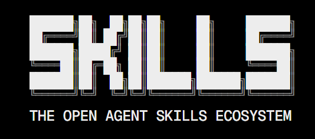

# Skills (Habilidades)



Las **Skills** son paquetes de **experiencia bajo demanda**. A diferencia del contexto general (`AGENTS.md`) que siempre está activo, las habilidades contienen instrucciones, scripts auxiliares, plantillas (templates) y recursos que el agente solo carga mediante **progressive disclosure** (revelación progresiva). 

¿Qué significa esto? El agente solo inyectará esta información en su contexto cuando detecte que la tarea actual coincide con la descripción de la skill. Esto evita saturar la memoria con información irrelevante y permite dotar al agente de roles técnicos muy específicos.

## 1. Consejos de Diseño

### Propósito Único y Caja Negra
Una skill debe resolver un solo problema. No pidas al agente que escriba scripts complejos al vuelo; utiliza scripts ya existentes dentro de la carpeta de la skill.

### Metadata y Triggers
El agente activa la skill basándose en la descripción y los triggers. Si son vagos, la activación será errática o incorrecta.

---

## 2. Metadatos de una Skill (Frontmatter)

### Atributos de Identificación
El archivo `SKILL.md` utiliza YAML frontmatter para controlar el comportamiento del modelo.

- `name` *(Requerido)*: Identificador único, corto y en minúsculas (ej. `api-auditor`).
- `description` *(Requerido)*: Explicación detallada. Señal principal para la activación.
- `trigger`: Frases exactas de activación (ej. `"auditar api"`).

### Control de Invocación y Herramientas
- `allowed-tools`: Lista estricta de herramientas permitidas.
- `context`: Configuración `fork` para aislamiento en subagentes.
- `dependencies`: Servidores MCP obligatorios.
- `allow_implicit_invocation`: Define si el modelo puede activarla solo o requiere comando manual.

#### Ejemplo: Frontmatter Avanzado
```yaml
---
name: auditor-seguridad
description: Experto en auditoría de seguridad para APIs REST. Actívalo para buscar vulnerabilidades OWASP.
trigger: "auditar api", "seguridad endpoint", "revisar vulnerabilidades"
allowed-tools: ["read_file", "run_shell_command"]
context: fork
dependencies: ["github-mcp"]
allow_implicit_invocation: false
---
```

---

## 3. Estructuras y Templates de Referencia

### Estructura de Directorios (Proyecto)
```text
📁 mi-proyecto/
├── 📁 .agents/                 (O .gemini/ o .claude/)
│   └── 📁 skills/
│       ├── 📁 python-reviewer/ (Skill Simple)
│       │   └── 📄 SKILL.md
│       │
│       ├── 📁 video-optimizer/ (Skill + Scripts)
│       │   ├── 📄 SKILL.md
│       │   └── 📁 scripts/
│       │       ├── 📄 optimizer.js
│       │       └── 📄 validate.py
│       │
│       └── 📁 tech-reporter/   (Skill + Templates)
│           ├── 📄 SKILL.md
│           └── 📁 templates/
│               └── 📄 design-record.md
```

### Ejemplo A: Skill con Scripts (Lógica Compleja)
Ideal cuando la skill necesita procesar datos mediante herramientas externas.

#### Estructura de Directorios
```text
skills/video-tool/
├── SKILL.md
└── scripts/
    └── optimizer.js
```

#### Ejemplo: Definición de Skill (`SKILL.md`)
```markdown
---
name: video-optimizer
description: Usa esta skill cuando el usuario necesite comprimir o convertir archivos de video MP4 usando herramientas CLI.
trigger: "optimizar video", "ffmpeg", "convertir mp4"
allowed-tools: ["run_shell_command"]
---

# Goal
Ejecutar el script de validación incluido para procesar videos según los parámetros del proyecto.

# Logic (Scripts)
Para optimizar archivos de video, debes ejecutar el script adjunto: `node $SKILL_DIR/scripts/optimizer.js <input>`. No intentes escribir el comando `ffmpeg` tú mismo.

# Steps
1. **Plan:** Analiza la petición del usuario y determina los parámetros de compresión.
2. **Execute:** Ejecuta el script de optimización. Analiza el `stdout` del script para dar la respuesta final.
3. Si el script falla (exit code != 0), lee el mensaje de error y ajusta los parámetros en un bucle hasta que pase la validación. NO hagas preguntas interactivas.
```

### Ejemplo B: Skill con Templates (Documentación)
Asegura que el agente siempre responda con un formato estandarizado.

#### Estructura de Directorios
```text
skills/arch-doc/
├── SKILL.md
└── templates/
    └── design-record.md
```

#### Ejemplo: Template (`design-record.md`)
```markdown
# Reporte de Arquitectura: {{title}}
**Fecha:** {{date}}
**Autor:** AI Agent

## Hallazgos
{{findings}}
```

**Contenido completo de `tech-reporter/SKILL.md`:**
```markdown
---
name: tech-reporter
description: Usa esta skill para generar reportes técnicos estandarizados, resúmenes de PR o informes de arquitectura.
trigger: "generar reporte", "resumen técnico", "informe de arquitectura"
---

# Goal
Crear un documento Markdown siguiendo estrictamente la estructura definida en nuestras plantillas internas.

# Output Format (Templates)
Al generar el reporte, debes leer obligatoriamente el archivo `$SKILL_DIR/templates/design-record.md`. Copia su estructura exacta y rellena las variables `{{title}}`, `{{date}}` y `{{findings}}`. Nunca inventes un formato nuevo.

# Steps
1. Recopilar datos del contexto actual usando las herramientas disponibles.
2. Rellenar el template sin alterar su estructura base.
3. Guardar el resultado en la carpeta `/reports`.
```

### Ejemplo C: Integración con Servidores MCP
Ideal para extender las capacidades del agente con herramientas de red o bases de datos.

#### Ejemplo: Referencia a MCP (`SKILL.md`)
```markdown
---
name: doc-search-helper
description: Úsalo para buscar información en la documentación técnica oficial cuando el usuario pregunte sobre APIs.
dependencies: ["mi-mcp-server"]
---

# Asistente de Documentación

Utiliza la herramienta disponible del servidor MCP para buscar en la documentación.
1.  No inventes APIs.
2.  Usa la herramienta `search_docs` proporcionada por el servidor MCP.
3.  Cita la URL fuente devuelta por la herramienta.
```

## 4. Modelos de Organización Avanzados

### Monorepo de Skills
Cuando varias skills comparten recursos o utilidades comunes.

#### Estructura de Directorios

```text
my-project/
├── skills/
│   ├── summarize/
│   │   └── SKILL.md
│   ├── translate/
│   │   └── SKILL.md
│   └── extract/
│       └── SKILL.md
├── shared/
│   └── utils.ts
└── README.md
```
**Cuándo usarla:** Proyecto de skills reutilizables, tipo librería interna o monorepo de agentes.

### Skill con Ejemplos (Few-Shot)
Los ejemplos muestran al agente el output exacto esperado mediante archivos de referencia.

#### Estructura de Directorios

```text
my-project/
├── skill/
│   └── SKILL.md
├── examples/
│   ├── input-1.txt
│   ├── output-1.txt
│   ├── input-2.txt
│   └── output-2.txt
└── README.md
```
**Cuándo usarla:** La skill produce outputs complejos o con formato muy específico. Los ejemplos prácticos (few-shot) son mucho más efectivos que describirlo en palabras.

#### Ejemplo: Instrucciones Few-Shot
```markdown
---
name: data-extractor
description: Usa esta skill para extraer información estructurada (JSON) a partir de logs crudos.
trigger: "extraer datos", "parsear logs"
---

# Goal
Convertir el texto crudo del usuario en un JSON válido según nuestro esquema interno.

# Examples
Para entender el formato exacto que debes devolver, lee los siguientes ejemplos en la carpeta de la skill:
- Ejemplo 1: Lee `$SKILL_DIR/examples/input-1.txt` y compáralo con el resultado esperado en `$SKILL_DIR/examples/output-1.txt`.
- Ejemplo 2: Lee `$SKILL_DIR/examples/input-2.txt` y compáralo con el resultado esperado en `$SKILL_DIR/examples/output-2.txt`.

# Steps
1. Recibe el texto del usuario.
2. Basándote ESTRICTAMENTE en los patrones vistos en los archivos `examples/`, genera el JSON.
3. Devuelve únicamente el JSON, sin texto explicativo adicional.
```

---

## 5. Mejores Prácticas (Estándar AgentSkills.io)

El diseño de una Skill determina directamente su tasa de éxito y eficiencia en costos. Siguiendo las normativas del estándar AgentSkills, aquí tienes las heurísticas de diseño para una arquitectura robusta:

### 5.1. Optimización del Motor de Descubrimiento (Triggers)
El atributo `description` y los `triggers` no son comentarios pasivos; representan el **motor semántico** mediante el cual un orquestador decide inyectar o ignorar la habilidad en su contexto.

- **Firma Accionable:** Utiliza verbos imperativos exactos (ej. "Valida", "Transforma", "Despliega") en lugar de sustantivos abstractos.
- **Señales Negativas:** Especifica explícitamente **cuándo NO** usar la skill dentro de la propia descripción (ej. *"No la actives para revisiones de sintaxis frontend"*). Esto previene que el agente se distraiga en tareas superpuestas.

### 5.2. Diseño de Instrucciones Resilientes
Los modelos de lenguaje son sistemas probabilísticos. Para forzar resultados deterministas dentro de tu Skill, debes guiar su raciocinio algorítmicamente.

- **Control de Flujo Numérico:** Para procesos delicados (ej. publicación de paquetes NPM, migraciones de base de datos), desglosa las acciones en checklists secuenciales estrictos.
- **El Bucle Plan-Validate-Execute:** Obliga al agente a documentar su plan, validarlo contra una regla de negocio y solo entonces ejecutar comandos potencialmente destructivos o escrituras finales.

### 5.3. Sistema de Evaluación Integral (Evals)
Nunca distribuyas una Skill para tu equipo sin probarla en múltiples escenarios. Desarrollar Skills es desarrollo de software; el *System Prompt* es código compilado por redes neuronales.

> [!TIP]
> **Metodología Delta de Eficiencia:** Evalúa estrictamente la diferencia en tokens y tiempo de CPU que emplea el agente al resolver un problema **sin la skill** versus **con la skill activada**. Si el modelo tarda más turnos de iteración usando la skill, el diseño de la misma es deficiente y debe ser reescrito.

Para integrar pruebas robustas (Testing AI), diseña casos de prueba que contengan:
1. **Entornos Aislados (Fixtures):** Un directorio con archivos de código falsos y un *prompt* base que imite al humano al hacer la petición en la terminal.
2. **Aserciones Categóricas:** Aléjate de evaluaciones difusas y relativas. Aplica aserciones binarias inmutables: *"¿El compilador arroja exit 0?"*, *"¿El archivo final está estructurado estrictamente en JSON válido?"*.
3. **Traza Cognitiva (Traceability):** Revisa las transcripciones del razonamiento (lo que el modelo "piensa" antes de usar la herramienta) para descubrir la línea exacta donde ignoró tu `SKILL.md` y recalibra la instrucción o el script subyacente.

---

## 6. Errores Comunes (Antipatrones)

La creación de Skills puede fallar si no se respeta el diseño de **Revelación Progresiva (Progressive Disclosure)** o si se confunde el propósito de una Skill con el contexto global de todo el repositorio. Evita los siguientes antipatrones críticos para mantener a tus agentes rápidos y eficaces:

### 1. Triggers Genéricos o Ambiguos
Configurar triggers demasiado comunes provoca **falsos positivos** (la skill se inyecta en la memoria del agente cuando no hace falta, consumiendo valiosos tokens de contexto y robando la atención del modelo).
* **Incorrecto:** `trigger: "ayuda", "revisar código", "json"`
* **Correcto:** `trigger: "auditar api rest", "generar reporte arquitectura", "análisis owasp"`

### 2. El `SKILL.md` Monolítico
Una skill nunca debe contener 500 líneas de reglas ni enormes JSONs incrustados en su archivo principal. Si obligas al agente a leer todo eso, se quedará sin ventana de contexto antes de empezar.
* **La Solución:** Utiliza estructuras multi-archivo. Si requieres que el agente entienda una gran estructura de datos, usa referencias: *"Lee estrictamente el esquema de referencia ubicado en `$SKILL_DIR/templates/schema.json` y basa tu trabajo en él"*.

### 3. Reglas Globales dentro de una Skill
Una skill no es el lugar para definir el stack tecnológico de todo el equipo. 
* **Incorrecto:** Escribir en un `SKILL.md`: *"En este proyecto programamos usando TypeScript Estricto y TailwindCSS"*.
* **La Solución:** Las directrices a nivel repositorio pertenecen única y exclusivamente al archivo `AGENTS.md`. Las Skills son herramientas especializadas; su función es ejecutar tareas, no definir el marco de desarrollo.

> [!WARNING]
> **Consecuencia letal:** Si pones la regla de usar TypeScript dentro de la skill `"auditar api"`, el agente perderá esa instrucción y volverá a escribir código inseguro en cuanto la skill se descargue de su memoria activa al terminar la auditoría.

### 4. Automatización Crítica sin Manejo de Errores (Infinite Loops)
Dejar que el agente ejecute un script (ej. `$SKILL_DIR/scripts/deploy.js`) sin darle instrucciones de qué hacer si falla, provoca un antipatrón donde el agente entra en pánico y reintenta la orden en bucle hasta agotar sus *max turns* o el saldo de la API.
* **La Solución:** Instruye resiliencia determinista: *"Si el script falla (exit code != 0), lee los errores de `stdout`, diseña una propuesta de solución y **ESPERA** confirmación humana antes de volver a ejecutarlo"*.
---

## 7. Colecciones y Recomendaciones (Discovery)

### Colección Personal (FranMT-S)
Estoy creando una coleccion personal para diferentes propositos, si deseas verla puede servirte de guia para crear los tuyos propios. la  iré actualizando periódicamente, puedes visitar los siguientes enlaces:

> [!NOTE]
> Colección de directorios en el repositorio:
> - 🧩 **[Directorio de Skills](https://github.com/FranMT-S/AI-Agents-Guide/tree/main/src/skills/)**
> - 📋 **[Templates para Skills](https://github.com/FranMT-S/AI-Agents-Guide/tree/main/src/templates/skills)**

### Marketplaces (Skills.sh)
Busca y descarga skills listas para usar. Siempre audita los permisos antes de instalar.

### Vercel React Best Practices
Enforza normativas oficiales de Next.js y React directamente en el flujo del agente.

### Integración ClickUp (API Based)
Alternativa al servidor MCP cuando se requiere mayor control sobre la lógica de gestión de tareas.
1. Copia `.env.template` a `.env` en la ruta de la skill (usualmente `~/.agents/skills/clickup`) y añade tu `CLICKUP_API_TOKEN`.
2. Instala dependencias internamente:
```bash
cd ~/.agents/skills/clickup && npm install
```
3. O instálala vía CLI:
```bash
npx skills add https://github.com/civitai/civitai --skill clickup
```
Si falta el `package.json`, puedes definir uno básico (o pedirle a la IA que lo deduzca):
```json
{
  "name": "clickup-skill",
  "version": "1.0.0",
  "description": "ClickUp skill for Agents",
  "type": "module",
  "dependencies": {
    "unified": "^11.0.4",
    "remark-parse": "^11.0.0",
    "dotenv": "^16.3.1",
    "node-fetch": "^3.3.2"
  }
}
```

---

## 8. Rutas Globales y Scopes

### Tabla de Rutas por Herramienta
A continuación se detalla dónde cada agente busca y descubre las skills instaladas, tanto a nivel global (disponibles en cualquier terminal/proyecto) como a nivel local (restringidas al repositorio actual).

| Herramienta | Ruta Global (Usuario) | Ruta Local (Proyecto) | Notas |
| :--- | :--- | :--- | :--- |
| **Antigravity** | `~/.agents/skills/` | `.agents/skills/` | Usa el directorio estándar `.agents` (agnóstico). |
| **Claude Code** | `~/.claude/skills/` | `.claude/skills/` | Soporta configuración a nivel *Enterprise* vía entorno. |
| **Codex CLI** | `~/.agents/skills/` | `.agents/skills/` | Requiere manifiesto `openai.yaml` además del directorio. |
| **Gemini CLI** | `~/.gemini/skills/` | `.gemini/skills/` | Soporta skills empaquetadas en extensiones NPM/GitHub. |
| **OpenCode** | `~/.opencode/skills/` | `.opencode/skills/` | Escanea automáticamente `.claude/` y `.agents/` heredando sus skills. |

### Seguridad y Sandboxing
Protege el contexto mediante aislamiento de variables (`$SKILL_DIR`) e invocaciones explícitas para tareas críticas.

- **Permisos de Archivos:** En **Gemini CLI**, al activar una skill, el usuario recibe una solicitud de aprobación para que el agente pueda leer los archivos *dentro* de la carpeta de esa skill específica.
- **Variables de Entorno:** Puedes usar variables como `$SKILL_DIR` (o `${CLAUDE_SKILL_DIR}`) para referenciar scripts locales sin importar la ruta actual del proyecto.
- **Invocación Implícita vs Explícita:** Para tareas críticas (como despliegues a producción), se recomienda configurar `allow_implicit_invocation: false` (Codex) o `disable-model-invocation: true` (Claude) para que solo el usuario pueda disparar la acción manualmente.