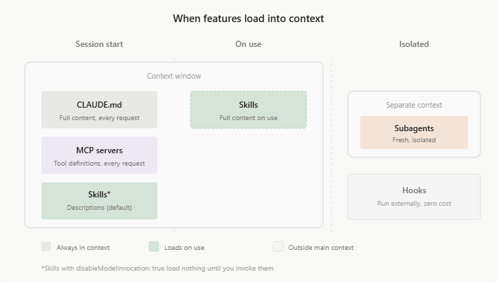

# Claude Code

Esta guía detalla las características exclusivas de Claude Code en cuanto a la gestión de contexto, habilidades, automatización, sub-agentes y Agent Teams.



## Gestión de Contexto (Memory & Agents.md)

Claude Code utiliza principalmente los archivos `CLAUDE.md`, `.claude/rules/*.md` y `CLAUDE.local.md`. También soporta el estándar `AGENTS.md`.

### Auto Memory y Reglas de Ruta
Su característica más destacada es el **Auto Memory**: Claude genera su propio archivo `MEMORY.md` para recordar aprendizajes de depuración. La propiedad `paths` permite limitar reglas a carpetas específicas, y admite `symlinks` para compartir configuraciones.

### Estructura de Directorios
```text
~/.claude/CLAUDE.md              (Global — preferencias universales del usuario)
mi-proyecto/
├── AGENTS.md                    (Proyecto — reglas del repositorio)
├── CLAUDE.md                    (Proyecto — reglas del repositorio)
├── CLAUDE.local.md              (Proyecto local — ignorado en Git)
└── .claude/
    └── rules/
        └── testing.md           (Modulo — reglas específicas por contexto)
```

### Ejemplo de Configuración (Frontmatter)
```yaml
---
description: Reglas para el backend
paths: ["src/backend/**"]
---
```
*Fuente: [Claude Code: Memory & Agents.md](https://code.claude.com/docs/en/memory#agents-md)*

## Skills (Habilidades)

Claude Code implementa el sistema de Skills con una jerarquía de tres niveles: **Enterprise** (distribuidas por la organización), **Personal** (`~/.claude/skills/`) y **Project** (`.claude/skills/`). Lo que distingue a Claude Code del resto es la riqueza de sus metadatos YAML: permite controlar el aislamiento de ejecución, las herramientas disponibles para la skill, y si el modelo puede autoinvocarla.

La propiedad más poderosa y única en el ecosistema es **`context: fork`**: cuando está activa, la skill se ejecuta en un subagente separado con su propio contexto aislado. Esto es ideal para skills que necesitan leer grandes cantidades de código sin contaminar la ventana de atención del agente principal. Al terminar, el subagente retorna solo el resultado al coordinador, descartando el contexto temporal.

### Estructura de Directorios

```text
~/.claude/skills/
└── personal-conventions/
    └── SKILL.md              (Personal — disponible en todos los proyectos)

mi-proyecto/
└── .claude/
    └── skills/
        └── api-security-audit/   (Proyecto — específico de este repositorio)
            ├── SKILL.md
            └── checklist.md
```

### Propiedades YAML Avanzadas

| Propiedad | Descripción |
| :--- | :--- |
| `allowed-tools` | Lista de herramientas permitidas para esta skill (allowlist). |
| `context: fork` | Ejecuta la skill en un subagente aislado para proteger el contexto principal. |
| `disable-model-invocation: true` | Impide que el agente invoque la skill automáticamente; solo activación manual. |

### Ejemplo: Skill de Auditoría de Seguridad (`SKILL.md`)

```markdown
---
name: api-security-audit
description: Audits REST API endpoints for security vulnerabilities. Use before merging API changes.
allowed-tools:
  - read_file
  - grep_search
context: fork
disable-model-invocation: false
---
# API Security Audit

Review all files provided for these critical vulnerabilities:

1. SQL Injection: look for raw string concatenation in queries
2. Missing input validation: check all route handlers for Zod/Joi schemas
3. Auth bypass: verify that all protected routes check the session token
4. Secrets in code: grep for hardcoded API keys or passwords

For each issue found, report: file path, line number, severity (critical/high/medium), and remediation.

Reference the accepted patterns in {file:./checklist.md}
```

> [!TIP]
> La variable `${CLAUDE_SESSION_ID}` es inyectada automáticamente en el contexto de cualquier skill. Úsala en scripts de logging para correlacionar la actividad de la skill con la sesión del agente sin necesidad de configuración adicional.

*Fuente: [Claude: Skills Guide](https://code.claude.com/docs/en/skills)*


## MCP (Model Context Protocol)

### Transportes y Protocolos
Soporta `Stdio` y `HTTP`. Implementa `Tools`, `Prompts`, `Resources` y **Channels** para notificaciones push asíncronas (ej. alertas de sistemas CI).

### Jerarquía y Seguridad
Sigue una configuración jerárquica: `Enterprise` (`managed-mcp.json`), `Local/Project` (`.mcp.json`) y `User` (`~/.claude.json`). Permite `headersHelper` para tokens dinámicos y restricción mediante `allowedMcpServers` y `deniedMcpServers`.

### Estructura de Directorio
```text
mi-proyecto/
└── .mcp.json
```

### Ejemplo de Configuración (`.mcp.json`)
```json
{
  "mcpServers": {
    "github": {
      "command": "npx",
      "args": ["-y", "@modelcontextprotocol/server-github"]
    }
  },
  "allowedMcpServers": ["github"],
  "deniedMcpServers": ["local-fs"]
}
```
*Fuente: [Claude Code: MCP Guide](https://code.claude.com/docs/en/mcp)*

## Plugins y Extensiones

> [!TIP]
> Consulta **[Plugins y Extensiones: Guía Técnica](../concepts/plugins.md)** para la comparativa completa entre sistemas, schemas y ejemplos de producción.

En Claude Code, un plugin es una **estructura de directorios con convención de carpetas**. Claude Code detecta y carga automáticamente los componentes según el directorio en el que estén: skills desde `skills/`, subagentes desde `agents/`, hooks desde `hooks/hooks.json`, MCP desde `.mcp.json` y servidores LSP desde `.lsp.json`. El archivo `plugin.json` solo declara metadata de identificación — no lista los componentes.

### Estructura de Directorio

```text
mi-plugin/
├── .claude-plugin/
│   └── plugin.json          (Solo metadata: name, version, description, author)
├── skills/
│   └── code-review/
│       └── SKILL.md         (Cargada por convención de directorio)
├── agents/
│   └── reviewer.md          (Cargado por convención de directorio)
├── hooks/
│   └── hooks.json           (Cargado por convención de directorio)
├── .mcp.json                (Servidores MCP del plugin)
└── .lsp.json                (Servidores LSP para code intelligence)
```

### `plugin.json` — Metadata y Rutas (Component Path Fields)

El plugin funciona por convención (carpetas default), pero puede sobreescribir las rutas explícitamente en el manifiesto con punteros a directorios o archivos:

```json
{
  "name": "typescript-plugin",
  "version": "1.0.0",
  "description": "Fullstack TS context",
  "skills": "./custom/skills/",
  "agents": "./custom/agents/",
  "hooks": "./config/hooks.json",
  "mcpServers": "./mcp-config.json",
  "lspServers": "./.lsp.json"
}
```

### Comandos de Gestión

```bash
# Añadir marketplace (GitHub)
/plugin marketplace add anthropics/claude-code

# Instalar plugin desde marketplace
/plugin install commit-commands@anthropics-claude-code

# Desarrollo local — cargar sin instalar
claude --plugin-dir ./mi-plugin

# Recargar plugins sin reiniciar
/reload-plugins

# Deshabilitar / habilitar / desinstalar
/plugin disable plugin-name@marketplace-name
/plugin enable plugin-name@marketplace-name
/plugin uninstall plugin-name@marketplace-name
```

*Fuentes: [Claude Code: Create Plugins](https://code.claude.com/docs/en/plugins) | [Claude Code: Discover Plugins](https://code.claude.com/docs/en/discover-plugins) | [Plugins Reference](https://code.claude.com/docs/en/plugins-reference)*


## Sub-agentes (Subagents)

> [!TIP]
> Consulta **[Subagentes: Arquitectura y Patrones](../concepts/subagentes.md)** para estrategias generales de orquestación, contratos de datos entre agentes y housekeeping antes de diseñar tu sistema.


Los sub-agentes son agentes especializados que operan en **ventanas de contexto aisladas** dentro de la misma sesión de Claude Code. El orquestador principal les delega tareas basándose en su `description`, y pueden ejecutarse en primer plano (bloqueante) o en segundo plano (concurrente con `Ctrl+B`).

### Capacidades Clave
- **Delegación automática:** El orquestador lee la `description` y decide cuándo delegar. También se pueden invocar explícitamente con `@nombre` o `--agent <nombre>`.
- **Aislamiento de herramientas:** Cada sub-agente puede restringir sus `tools` a un subconjunto (allowlist) o excluir herramientas específicas con `disallowedTools`.
- **Memoria persistente:** El campo `memory` (`user`, `project`, `local`) mantiene un `MEMORY.md` entre sesiones en `.claude/agent-memory/<nombre>/`.
- **Skills y MCP exclusivos:** Pueden precargar `skills` y definir `mcpServers` con scope exclusivo (inline o por referencia).
- **Hooks propios:** Soportan hooks del ciclo de vida (`PreToolUse`, `PostToolUse`, `Stop`) directamente en su frontmatter.
- **Sub-agentes Built-in:** Claude Code incluye `Explore` (Haiku, solo lectura), `Plan` (modelo heredado, solo lectura) y un sub-agente de propósito general.

### Estructura de Directorios
```text
~/.claude/agents/                (Global — disponibles en todos los proyectos)
    ├── researcher.md            (Sub-agente simple — archivo unico)
    └── api-auditor/             (Sub-agente con recursos — subdirectorio)
        ├── api-auditor.md       (El .md raiz define al sub-agente)
        └── context/             (Prompts de apoyo, estándares, ejemplos)
            └── api-standards.md
mi-proyecto/
└── .claude/
    ├── agents/                  (Proyecto — solo disponibles en este repo)
    │   ├── coordinator.md
    │   └── api-developer/
    │       ├── api-developer.md
    │       └── prompts/
    │           └── conventions.md
    ├── skills/                  (Skills que los sub-agentes pueden precargar)
    │   └── api-conventions.md
    └── agent-memory/            (Memoria persistente por sub-agente)
        └── researcher/
```

> [!TIP]
> La estructura por subdirectorios agrupa al sub-agente con sus archivos de apoyo. El `.md` cuyo nombre coincide con el directorio padre define al sub-agente; el resto son recursos de contexto inyectados automáticamente.

> [!IMPORTANT]
> **Estrategia de Modelos en Orquestación:** Al configurar subagentes en OpenCode, utiliza modelos **Ligeros** (Haiku 4.5 o GPT-5.4 mini) para las fases de descubrimiento y lectura. Reserva los modelos **Pesados** (Sonnet o GPT-5.3-Codex) exclusivamente para el agente `coder` final.

### Campos del Frontmatter (Sub-agentes)

| Campo             | Descripción                                                                      | Valores                                                       |
| ----------------- | -------------------------------------------------------------------------------- | ------------------------------------------------------------- |
| `name`            | Identificador del sub-agente                                                     | string                                                        |
| `description`     | Cuándo invocarlo (el orquestador lo lee para delegar)                            | string                                                        |
| `model`           | Modelo a usar                                                                    | `haiku`, `sonnet`, `opus`, ID completo, `inherit`             |
| `tools`           | Allowlist de tools permitidas                                                    | `Read`, `Write`, `Bash`, `Agent`, `Grep`, etc.                |
| `disallowedTools` | Tools a excluir del total heredado                                               | Mismos valores que `tools`                                    |
| `skills`          | Skills a precargar en el contexto                                                | lista de nombres                                              |
| `mcpServers`      | Servidores MCP exclusivos (inline o por referencia)                              | nombre o config completa                                      |
| `hooks`           | Hooks del ciclo de vida (`PreToolUse`, `PostToolUse`, `Stop`)                    | objeto de hooks                                               |
| `memory`          | Alcance de la memoria persistente                                                | `user`, `project`, `local`                                    |
| `permissionMode`  | Modo de permisos                                                                 | `default`, `acceptEdits`, `auto`, `dontAsk`, `bypassPermissions`, `plan` |
| `background`      | Ejecutar concurrentemente en segundo plano                                       | `true` / `false`                                              |
| `effort`          | Nivel de esfuerzo del modelo                                                     | `low`, `medium`, `high`, `max`                                |
| `isolation`       | Ejecutar en Git Worktree aislado                                                 | `worktree`                                                    |
| `maxTurns`        | Limite de turnos de razonamiento                                                 | numero                                                        |
| `color`           | Color en la UI                                                                   | `red`, `blue`, `green`, `yellow`, `purple`, `orange`, `pink`, `cyan` |
| `initialPrompt`   | Prompt inicial al iniciar con `--agent`                                         | string                                                        |

#### Referencia de Tools (valores para `tools` y `disallowedTools`)

| Categoria                  | Tools                                                                       |
| -------------------------- | --------------------------------------------------------------------------- |
| **Archivos**               | `Read`, `Write`, `Edit`, `Glob`, `Grep`                                     |
| **Terminal**               | `Bash`, `PowerShell`                                                        |
| **Web**                    | `WebFetch`, `WebSearch`                                                     |
| **Agentes y Skills**       | `Agent`, `Agent(nombre)`, `Skill`, `SendMessage`                            |
| **Tareas asíncronas**      | `TaskCreate`, `TaskGet`, `TaskList`, `TaskStop`, `TaskUpdate`, `TaskOutput` |
| **Modos**                  | `EnterPlanMode`, `ExitPlanMode`, `EnterWorktree`, `ExitWorktree`            |
| **Cron (scheduled tasks)** | `CronCreate`, `CronDelete`, `CronList`                                      |
| **Teams (experimental)**   | `TeamCreate`, `TeamDelete`                                                  |
| **MCP**                    | `ListMcpResourcesTool`, `ReadMcpResourceTool`, `ToolSearch`                 |
| **Otros**                  | `TodoWrite`, `NotebookEdit`, `LSP`, `AskUserQuestion`                       |

*Fuente: [Claude Code: Sub-agents](https://code.claude.com/docs/en/sub-agents)*

### Ejemplo: Sub-agente de API (`api-developer.md`)

```markdown
---
name: api-developer
description: Implements REST API endpoints following team conventions.
model: haiku
tools: Read, Glob, Grep, Write, Edit, Bash
skills:
  - api-conventions
  - error-handling-patterns
mcpServers:
  - github
  - playwright:
      type: stdio
      command: npx
      args: ["-y", "@playwright/mcp@latest"]
memory: project
permissionMode: acceptEdits
effort: high
color: blue
---
Implement REST API endpoints. Follow the conventions from the preloaded skills.
Do not modify files outside of src/api/.
```

### Ejemplo: Sub-agente con Hooks de Validación (`db-reader.md`)

```markdown
---
name: db-reader
description: Execute read-only database queries.
tools: Bash
hooks:
  PreToolUse:
    - matcher: "Bash"
      hooks:
        - type: command
          command: "./scripts/validate-readonly-query.sh"
---
Only execute SELECT queries. Never modify data.
```

---

## Agent Teams (Equipos de Agentes)

> [!WARNING]
> Agent Teams es una funcionalidad **experimental**. Requiere activar el flag `CLAUDE_CODE_EXPERIMENTAL_AGENT_TEAMS=1` en `settings.json` o como variable de entorno.

Los Agent Teams coordinan **múltiples sesiones independientes de Claude Code** trabajando en paralelo sobre un mismo proyecto. A diferencia de los sub-agentes (que operan dentro de la misma sesión), cada *teammate* es un proceso separado con su propia ventana de contexto, comunicándose mediante un sistema de mensajería y una lista de tareas compartida.

### Diferencias con los Sub-agentes

| Aspecto              | Sub-agentes                          | Agent Teams                          |
| -------------------- | ------------------------------------ | ------------------------------------ |
| **Arquitectura**     | Dentro de la misma sesión            | Procesos separados (multi-sesión)    |
| **Comunicación**     | Return value al orquestador          | Mensajería bidireccional + task list |
| **Visualización**    | Inline en el chat                    | In-process o split panes (`tmux`)    |
| **Coordinación**     | Secuencial o background              | Paralelo real con Lead + Teammates   |
| **Casos de uso**     | Tareas enfocadas, delegación simple  | Investigación paralela, refactoring multi-capa |
| **Estado**           | Estable                              | Experimental                         |

### Activación
Solo el Lead puede crear/destruir teammates. Las configuraciones persistentes se guardan en `.claude/settings.json`.

```json
{
  "env": {
    "CLAUDE_CODE_EXPERIMENTAL_AGENT_TEAMS": "1"
  }
}
```

### Cómo Funcionan
- **Lead:** La sesión principal que crea y gestiona al equipo. Solo el Lead puede crear/destruir teammates.
- **Teammates:** Sesiones independientes que ejecutan tareas de la lista compartida. Pueden usar definiciones de sub-agentes existentes como base (`tools`, `model`, `skills`, `mcpServers`).
- **Comunicación:** `message` (a un teammate específico) o `broadcast` (a todos). Los teammates notifican automáticamente al Lead cuando terminan.
- **Task list:** Lista compartida donde el Lead asigna tareas y los teammates las reclaman (*self-claim*).

### Modos de Visualización
- **In-process:** Todos ejecutan en la misma terminal. `Shift+Down` para navegar entre teammates. Funciona en cualquier terminal.
- **Split panes:** Cada teammate en su propio panel. Requiere `tmux` o `iTerm2`.

### Ejemplo de Uso

```text
Create an agent team to review PR #142. Spawn three reviewers:
 - One focused on security implications
 - One checking performance impact
 - One validating test coverage
Have them each review and report findings.
```

### Hooks Exclusivos de Agent Teams

| Hook              | Descripción                                                              |
| ----------------- | ------------------------------------------------------------------------ |
| `TeammateIdle`    | Se ejecuta cuando un teammate va a quedar inactivo. Exit `2` lo mantiene trabajando. |
| `TaskCreated`     | Se ejecuta al crear una tarea. Exit `2` previene la creación.           |
| `TaskCompleted`   | Se ejecuta al completar una tarea. Exit `2` previene el cierre.        |

*Fuente: [Claude Code: Agent Teams](https://code.claude.com/docs/en/agent-teams)*


## Hooks (Disparadores)

> [!TIP]
> Consulta **[Hooks: Interceptación Determinista](../concepts/hooks.md)** para la referencia completa de eventos, protocolo stdin/stdout, scripts de producción y anti-patrones.

Los hooks de Claude Code se configuran en `settings.json` bajo el objeto `hooks`. Cada entrada especifica el evento, un `matcher` opcional para filtrar por herramienta específica, y el comando externo a ejecutar. La comunicación ocurre via stdin/stdout en JSON estricto.

### Eventos Disponibles

| Evento | Momento de Disparo |
| :--- | :--- |
| `PreToolUse` | Antes de ejecutar cualquier herramienta (con `matcher` opcional por nombre) |
| `PostToolUse` | Después de que la herramienta retorna su resultado |
| `UserPromptSubmit` | Cuando el usuario envía un mensaje al agente |
| `PostResponse` | Cuando el agente termina de generar su respuesta completa |
| `Stop` | Cuando la sesión finaliza |

### Estructura de Directorio

```text
mi-proyecto/
└── .claude/
    ├── settings.json
    └── hooks/
        ├── protect-files.sh
        └── run-linter.sh
```

### Ejemplo de Configuración (`settings.json`)

```json
{
  "hooks": {
    "PreToolUse": [
      {
        "matcher": "Bash",
        "hooks": [
          {
            "type": "command",
            "command": "\"$CLAUDE_PROJECT_DIR\"/.claude/hooks/protect-files.sh",
            "timeout": 10
          }
        ]
      }
    ],
    "PostToolUse": [
      {
        "matcher": "Edit|Write",
        "hooks": [
          {
            "type": "command",
            "command": "\"$CLAUDE_PROJECT_DIR\"/.claude/hooks/run-linter.sh",
            "timeout": 30
          }
        ]
      }
    ]
  }
}
```

### Variables de Entorno Disponibles en Scripts

| Variable | Contenido |
| :--- | :--- |
| `$CLAUDE_PROJECT_DIR` | Raíz del directorio del proyecto |
| `$CLAUDE_TOOL_NAME` | Nombre de la herramienta que disparó el hook |
| `$CLAUDE_SESSION_ID` | ID de la sesión activa |

### Ejemplo: Protección de Archivos Críticos (`protect-files.sh`)

```bash
#!/usr/bin/env bash
# Blocks writes to critical config and secret files.

INPUT=$(cat)
FILE=$(echo "$INPUT" | jq -r '.tool_input.file_path // ""')
COMMAND=$(echo "$INPUT" | jq -r '.tool_input.command // ""')

PROTECTED=(".env" ".env.local" ".env.production" "secrets.json" "*.pem")

for PATTERN in "${PROTECTED[@]}"; do
  if echo "$FILE" | grep -q "$PATTERN" || echo "$COMMAND" | grep -q 'rm -rf'; then
    echo "BLOCKED: Action on protected resource '$FILE'" >&2
    exit 2
  fi
done

exit 0
```

> [!IMPORTANT]
> El código de salida `2` es el mecanismo fail-closed: la herramienta es abortada y el error se retroalimenta al modelo. Usa exit `1` para errores del propio script y `2` únicamente para bloqueos intencionales de política.

*Fuente: [Claude Code: Hooks Guide](https://code.claude.com/docs/en/hooks-guide)*


## Automatización (Headless Mode)

Claude Code es la herramienta con el modo headless más completo del ecosistema. El flag `-p` convierte al agente en un proceso no interactivo que recibe el prompt por argumento y termina con código de salida `0` (éxito) o `1` (error), integrable en cualquier pipeline de CI/CD.

### Flags de Control de Ejecución

| Flag | Descripción |
| :--- | :--- |
| `-p "prompt"` | Activa modo headless con el prompt especificado |
| `--allowedTools` | Lista de herramientas aprobadas sin confirmación manual (ej. `Read,Write,Bash`) |
| `--disallowedTools` | Lista de herramientas bloqueadas |
| `--bare` | Omite configuración global, hooks y CLAUDE.md. Ideal para aislamiento total en CI |
| `--max-turns N` | Máximo de iteraciones antes de terminar (previene bucles infinitos) |
| `--output-format` | Formato de salida: `text` (default), `json`, `stream-json` |
| `--json-schema` | Fuerza que el output JSON cumpla un esquema específico |
| `--verbose` | Log detallado de cada acción del agente |

### Formatos de Output

```bash
# Output en JSON estructurado — ideal para procesar con jq en pipelines
claude -p "Analyze the test failures and return findings" \
  --output-format json \
  --allowedTools "Read,Grep,Glob"

# Stream JSON — útil para procesamiento en tiempo real
claude -p "Generate release notes from git log since last tag" \
  --output-format stream-json \
  | jq '.content[] | select(.type=="text") | .text'
```

### Scheduled Tasks (`/loop`)

Claude Code soporta tareas programadas mediante el comando `/loop` con sintaxis CRON. El agente se registra para ejecutarse en el intervalo definido sin necesidad de un cronjob externo.

```text
/loop 0 8 * * 1-5 "Generate the daily standup report from yesterday's git commits and open issues"
```

### Ejemplo: CI/CD Reactivo (GitHub Actions)

```yaml
name: AI Code Review

on:
  pull_request:
    branches: [main, develop]

jobs:
  ai-review:
    runs-on: ubuntu-latest
    steps:
      - uses: actions/checkout@v4
        with:
          fetch-depth: 0

      - name: Review PR with Claude Code
        run: |
          git diff origin/${{ github.base_ref }}...HEAD > changes.diff
          
          claude -p "
            Review the attached diff for:
            1. Security vulnerabilities (injection, auth bypass, secrets)
            2. Logic errors and unhandled edge cases
            3. Missing test coverage for new code
            Apply AGENTS.md conventions. Return a JSON array of findings.
            $(cat changes.diff)
          " \
            --allowedTools "Read,Grep,Glob" \
            --bare \
            --max-turns 10 \
            --output-format json > review.json
          
          # Block PR on critical findings
          CRITICAL=$(jq '[.[] | select(.severity == "critical")] | length' review.json)
          if [ "$CRITICAL" -gt "0" ]; then
            echo "Critical issues found:" && jq '.[] | select(.severity=="critical")' review.json
            exit 1
          fi
        env:
          ANTHROPIC_API_KEY: ${{ secrets.ANTHROPIC_API_KEY }}
```

> [!TIP]
> Usa `--bare` en pipelines de CI para evitar que configuraciones locales del desarrollador contaminen la ejecución en el servidor. Sin `--bare`, el agente carga el `~/.claude/CLAUDE.md` global del usuario que ejecuta el runner.

*Fuentes: [Claude Code: Headless Mode](https://code.claude.com/docs/en/headless) | [Claude Code: Scheduled Tasks](https://code.claude.com/docs/en/scheduled-tasks)*

