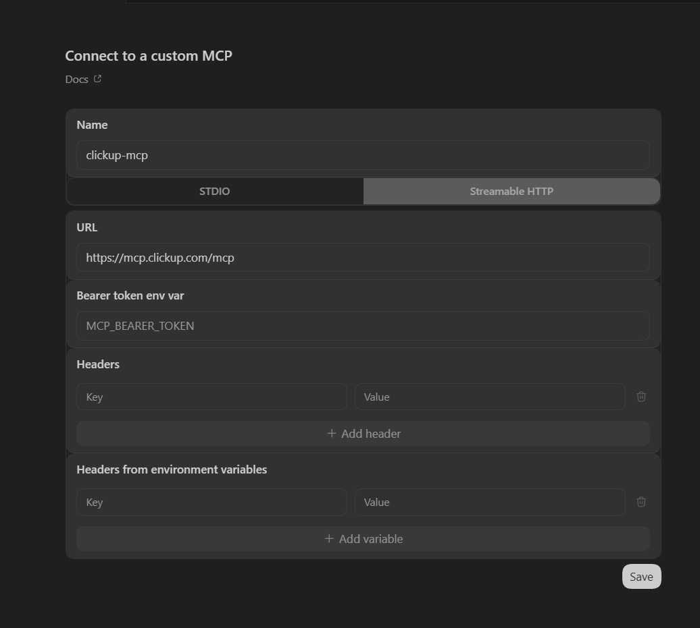
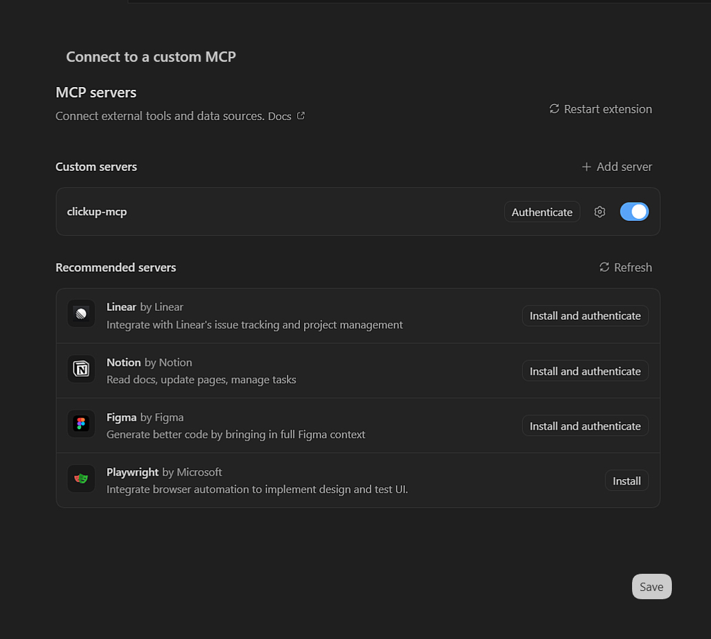

# OpenAI Codex CLI

Esta guía detalla las características exclusivas de Codex CLI en cuanto a la gestión de contexto, habilidades, subagentes y automatización.

## Gestión de Contexto (Agents.md Guides)

### AGENTS.md y Overrides
Codex utiliza `AGENTS.md` como estándar principal, permitiendo priorizar reglas mediante `AGENTS.override.md`.

### Límites y Configuración de Proyecto
Impone un límite de 32 KiB (`project_doc_max_bytes`) para la cadena de instrucciones. Permite configurar nombres alternativos con `project_doc_fallback_filenames`.

### Estructura de Directorios
```text
~/.codex/AGENTS.md               (Global — preferencias universales del usuario)
mi-proyecto/
├── AGENTS.md                    (Proyecto — reglas base del repositorio)
├── AGENTS.override.md           (Proyecto — anula el AGENTS.md local)
└── src/
    └── api/
        └── AGENTS.override.md   (Modulo — anula reglas para este subdirectorio)
```
*Fuente: [Codex CLI: Agents.md Guides](https://developers.openai.com/codex/guides/agents-md)*

## Skills (Habilidades)

Codex CLI tiene la arquitectura de Skills más explícita del ecosistema: en lugar de un simple archivo `SKILL.md` autodescriptivo, requiere un **manifiesto YAML** (`agents/openai.yaml`) que declara formalmente cada habilidad disponible en el proyecto. Este manifiesto controla si la skill puede invocarse automáticamente o solo de forma manual, qué servidores MCP necesita activos para funcionar, y cómo se presenta visualmente en la UI.

Las skills siguen el mismo orden de descubrimiento que `AGENTS.md`: global (`~/.agents/skills/`), proyecto (`.agents/skills/`). Sin embargo, el manifiesto YAML actúa como registro de autoridad: si una skill no está declarada en él, no puede ser invocada por Codex aunque el archivo `SKILL.md` exista.

### Estructura de Directorio

```text
~/.agents/skills/
└── my-global-skill/
    └── SKILL.md               (Disponible en todos los proyectos)

mi-proyecto/
├── agents/
│   └── openai.yaml            (Manifiesto de habilidades del proyecto)
└── .agents/
    └── skills/
        └── code-formatter/
            └── SKILL.md
```

### Ejemplo Completo: Manifiesto (`agents/openai.yaml`)

```yaml
skills:
  - name: "code-formatter"
    display_name: "Code Formatter"
    description: "Formats code according to project standards using ESLint and Prettier."
    icon: "magic-wand"
    brand_color: "#3B82F6"
    allow_implicit_invocation: true
    dependencies:
      - "local-linter-mcp"

  - name: "api-reviewer"
    display_name: "API Reviewer"
    description: "Reviews REST endpoints for security and OpenAPI compliance."
    icon: "shield"
    allow_implicit_invocation: false
    dependencies:
      - "github-mcp"
```

> [!TIP]
> Usa `allow_implicit_invocation: false` en skills destructivas o de alto impacto. Esto garantiza que el agente nunca las active automáticamente por inferencia semántica; solo se invocan cuando el usuario las menciona explícitamente.

*Fuente: [Codex: Developers Skills](https://developers.openai.com/codex/skills)*


## MCP (Model Context Protocol)

### Configuración Compartida (CLI/IDE)
Codex sincroniza sus servidores MCP entre la terminal (CLI) y la extensión del IDE mediante un archivo `config.toml`. Soporta transportes **STDIO** (procesos locales) y **Streamable HTTP** (servidores remotos).

### Gestión de Servidores
Puedes gestionar servidores mediante comandos (`codex mcp add`) o editando directamente el archivo de configuración. Soporta autenticación mediante **Bearer Tokens** y flujos **OAuth** nativos (`codex mcp login`).

### Opciones de Configuración
Dentro de `[mcp_servers.<alias>]`, se aceptan los siguientes parámetros:

- **Para STDIO:** `command` (requerido), `args`, `cwd` y `env` (mapa de variables).
- **Para HTTP:** `url` (requerido), `bearer_token_env_var`, `http_headers` (estáticos) y `env_http_headers` (mapeo a variables de entorno).
- **Control de Ejecución:**
  - `enabled`: Permite desactivar un servidor sin borrarlo.
  - `required`: Si es `true`, Codex fallará al arrancar si el servidor no inicializa.
  - `enabled_tools`: Allowlist de herramientas.
  - `disabled_tools`: Denylist de herramientas (se aplica después del allowlist).
  - `startup_timeout_sec` (Default: 10) y `tool_timeout_sec` (Default: 60).

### Estructura de Directorio
```text
~/.codex/
└── config.toml
```

> [!NOTE]
> En entornos **Windows**, la inyección de variables de entorno en los comandos o configuraciones debe usar la sintaxis `%VAR_NAME%`.

#### Ejemplo de Configuración (`config.toml`)
```toml
[mcp_servers.context7]
command = "npx"
args = ["-y", "@upstash/context7-mcp"]
[mcp_servers.context7.env]
MY_API_KEY = "%CONTEXT7_TOKEN%"

[mcp_servers.figma-remote]
url = "https://mcp.figma.com/mcp"
bearer_token_env_var = "FIGMA_OAUTH_TOKEN"
enabled_tools = ["get_file", "get_comments"]
tool_timeout_sec = 45
```



*Fuente: [Codex CLI: MCP Developers](https://developers.openai.com/codex/mcp)*

## Hooks (Disparadores)

> [!TIP]
> Consulta **[Hooks: Interceptación Determinista](../concepts/hooks.md)** para la referencia completa de eventos, protocolo stdin/stdout, scripts de producción y anti-patrones.

Codex CLI implementa hooks con el mismo esquema JSON que Claude Code — la diferencia está en el directorio de configuración (`.codex/hooks.json`) y en el contexto de ejecución. Los scripts pueden estar en cualquier lenguaje; Python es el más usado por su capacidad de parsear y analizar el JSON de entrada de forma natural.

### Eventos Disponibles

| Evento | Momento de Disparo |
| :--- | :--- |
| `PreToolUse` | Antes de ejecutar cualquier herramienta (filtrable por `matcher`) |
| `PostToolUse` | Después de que la herramienta retorna su resultado |

### Schema de Configuración (`.codex/hooks.json`)

| Campo | Tipo | Descripción |
| :--- | :--- | :--- |
| `matcher` | string | Nombre de la herramienta a interceptar (`Bash`, `Write`, `Edit`, etc.) |
| `type` | string | Tipo de hook: `command` (único tipo disponible actualmente) |
| `command` | string | Comando a ejecutar (recibe JSON via stdin) |
| `statusMessage` | string | Mensaje visible al usuario mientras el hook corre |

### Estructura de Directorio

```text
mi-proyecto/
└── .codex/
    ├── hooks.json
    └── hooks/
        └── pre_tool_use_policy.py
```

### Ejemplo de Configuración (`.codex/hooks.json`)

```json
{
  "hooks": {
    "PreToolUse": [
      {
        "matcher": "Bash",
        "hooks": [
          {
            "type": "command",
            "command": "/usr/bin/python3 \".codex/hooks/pre_tool_use_policy.py\"",
            "statusMessage": "Checking Bash command policy"
          }
        ]
      }
    ]
  }
}
```

### Ejemplo: Política de Comandos Bash (`pre_tool_use_policy.py`)

```python
#!/usr/bin/env python3
# Blocks destructive bash commands before execution.

import sys
import json
import re

data = json.loads(sys.stdin.read())
command = data.get("tool_input", {}).get("command", "")

BLOCKED_PATTERNS = [
    r"rm\s+-rf\s+/",
    r"rm\s+-rf\s+~",
    r"DROP\s+TABLE",
    r"git\s+push\s+--force",
    r">\s*/dev/sd",
]

for pattern in BLOCKED_PATTERNS:
    if re.search(pattern, command, re.IGNORECASE):
        print(f"BLOCKED: Command matches restricted pattern: {pattern}", file=sys.stderr)
        sys.exit(2)

sys.exit(0)
```

*Fuente: [Codex CLI: Hooks](https://developers.openai.com/codex/hooks)*


## Subagentes

> [!TIP]
> Consulta los **[Patrones Avanzados Multi-Agente](../concepts/subagentes.md)** para estrategias generales de orquestación, contratos de datos estrictos y housekeeping antes de diseñar tu sistema.

Codex CLI es la única herramienta del ecosistema que usa **TOML** en lugar de Markdown para definir subagentes. Esta elección prioriza configuración tipada sobre legibilidad narrativa, haciendo los campos estrictamente declarativos. El orquestador puede instanciar múltiples subagentes en paralelo o en secuencia según la tarea, y cada uno opera en un `sandbox_mode` que define qué nivel de acceso tiene al sistema de archivos.

### Modos de Sandboxing

| `sandbox_mode` | Acceso | Cuándo usarlo |
| :--- | :--- | :--- |
| `read-only` | Solo lectura del workspace | Revisores, auditores, analizadores |
| `workspace-write` | Lectura y escritura en el directorio del proyecto | Builders, generadores de código |
| `network` | Lectura, escritura y acceso a red | Agentes que consultan APIs externas |

### Estructura de Directorio

```text
mi-proyecto/
└── .codex/
    └── agents/
        ├── architect.toml
        ├── builder.toml
        └── reviewer.toml
```

### Schema de Configuración (campos disponibles)

| Campo | Tipo | Descripción |
| :--- | :--- | :--- |
| `name` | string | Identificador del agente (sin espacios) |
| `description` | string | Cuándo invocarlo (el orquestador lo lee para decidir la delegación) |
| `model` | string | Modelo en formato OpenAI (ej. `gpt-5.4`, `gpt-5.3-codex`) |
| `sandbox_mode` | string | Nivel de acceso: `read-only`, `workspace-write`, `network` |
| `developer_instructions` | multiline string | System prompt completo del agente |

### Ejemplo: Revisor de Código (`reviewer.toml`)

```toml
name = "reviewer"
description = "Reviews code for correctness, security, and missing tests. Use before merging any PR."
model = "gpt-5.4"
sandbox_mode = "read-only"
developer_instructions = """
Review the provided code changes like an owner. Prioritize:
1. Correctness and unhandled edge cases
2. Security vulnerabilities (injection, auth bypass, secrets)
3. Missing or insufficient test coverage
4. Behavior regressions compared to the original implementation

Return findings as a structured list:
- File, line number, severity (critical/high/medium/low), issue, suggested fix

Do NOT approve if critical issues exist. Be specific — no generic feedback.
"""
```

### Ejemplo: Builder Autónomo (`builder.toml`)

```toml
name = "builder"
description = "Implements code based on a provided architectural plan. Use after architect defines the structure."
model = "gpt-5.3-codex"
sandbox_mode = "workspace-write"
developer_instructions = """
You implement code. You receive a structured plan and execute it file by file.

Rules:
- Follow the plan exactly. Do not add unrequested features.
- Apply all conventions from AGENTS.md in the project root.
- After each file change, output a brief summary of what was modified.
- If a plan step is ambiguous, return an error instead of guessing.
- On failure, revert partial changes with git checkout before reporting.
"""
```

*Fuente: [Codex CLI: Subagents Guide](https://developers.openai.com/codex/subagents)*


## Automatización y Scripting

Codex CLI está diseñado desde el principio para automatización. El comando `codex exec` es distinto al modo interactivo `codex`: acepta el prompt como argumento, ejecuta sin TTY y retorna códigos de salida estándar. El flag `--full-auto` elimina todas las confirmaciones interactivas, haciendo al agente completamente autónomo para su uso en pipelines.

### Flags de `codex exec`

| Flag | Descripción |
| :--- | :--- |
| `--full-auto` | Modo totalmente autónomo — sin confirmaciones de ningún tipo |
| `--sandbox MODE` | Nivel de sandboxing: `read-only`, `workspace-write`, `network` |
| `--output-schema PATH` | Valida el output JSON contra un schema (falla con exit `1` si no cumple) |
| `--max-steps N` | Límite de pasos de ejecución (previene bucles infinitos) |
| `--model ID` | Override del modelo para esta ejecución |
| `--quiet` | Suprime output de progreso, solo emite el resultado final |

### Flujo de Sandboxing

```bash
# Análisis de solo lectura — sin modificaciones al workspace
codex exec "Audit all API endpoints for missing auth middleware" \
  --full-auto \
  --sandbox read-only

# Refactorización autónoma — escritura limitada al workspace
codex exec "Migrate all .then() chains to async/await in src/" \
  --full-auto \
  --sandbox workspace-write \
  --max-steps 30

# Con validación de schema — el pipeline falla si el output no tiene la estructura esperada
codex exec "Generate a dependency report" \
  --full-auto \
  --sandbox read-only \
  --output-schema ./schemas/dependency-report.json \
  --quiet > report.json
```

### Output Schema (Validación Estructurada)

El flag `--output-schema` garantiza que el agente devuelva un JSON válido que sigue la estructura definida, o el proceso termina con código `1`. Esto previene que output malformado rompa las etapas siguientes del pipeline.

```json
{
  "$schema": "http://json-schema.org/draft-07/schema#",
  "type": "object",
  "required": ["summary", "findings", "recommendation"],
  "properties": {
    "summary": { "type": "string" },
    "findings": {
      "type": "array",
      "items": {
        "type": "object",
        "required": ["file", "issue", "severity"],
        "properties": {
          "file": { "type": "string" },
          "issue": { "type": "string" },
          "severity": { "enum": ["critical", "high", "medium", "low"] }
        }
      }
    },
    "recommendation": { "type": "string" }
  }
}
```

### Ejemplo: Refactorización Masiva en CI/CD

```yaml
name: AI Refactoring Pipeline

on:
  workflow_dispatch:
    inputs:
      task:
        description: 'Refactoring task description'
        required: true

jobs:
  refactor:
    runs-on: ubuntu-latest
    steps:
      - uses: actions/checkout@v4

      - name: Run Codex refactoring
        run: |
          codex exec "${{ github.event.inputs.task }}" \
            --full-auto \
            --sandbox workspace-write \
            --max-steps 40 \
            --output-schema ./schemas/refactor-result.json > result.json
        env:
          OPENAI_API_KEY: ${{ secrets.OPENAI_API_KEY }}

      - name: Commit and open PR
        run: |
          git config user.name "Codex Bot"
          git config user.email "bot@company.com"
          git checkout -b codex/refactor-${{ github.run_id }}
          git add -A
          git commit -m "refactor: $(jq -r '.summary' result.json)"
          gh pr create \
            --title "Codex Refactor: $(jq -r '.summary' result.json)" \
            --body "$(jq -r '.recommendation' result.json)" \
            --base main
        env:
          GH_TOKEN: ${{ secrets.GITHUB_TOKEN }}
```



*Fuente: [Codex: Non-interactive Usage](https://developers.openai.com/codex/noninteractive)*

